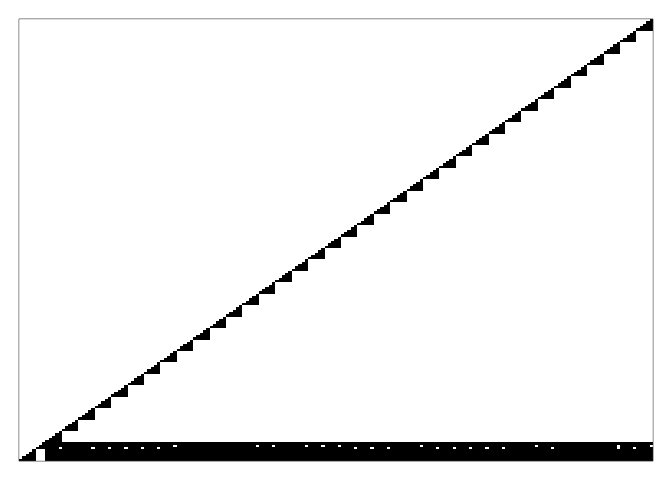
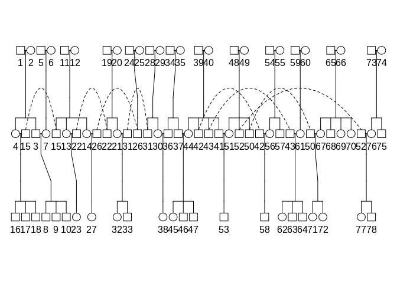
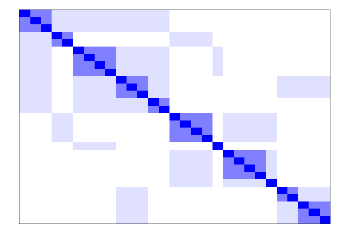
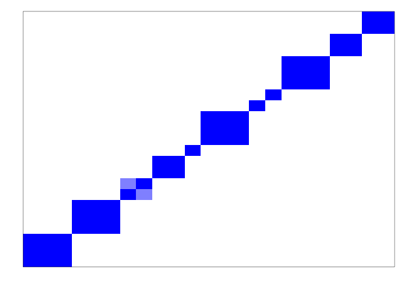
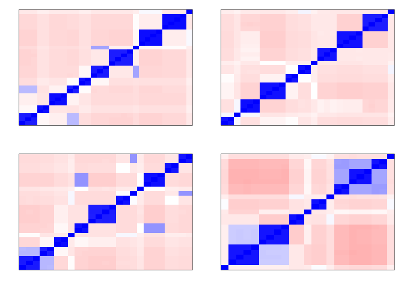
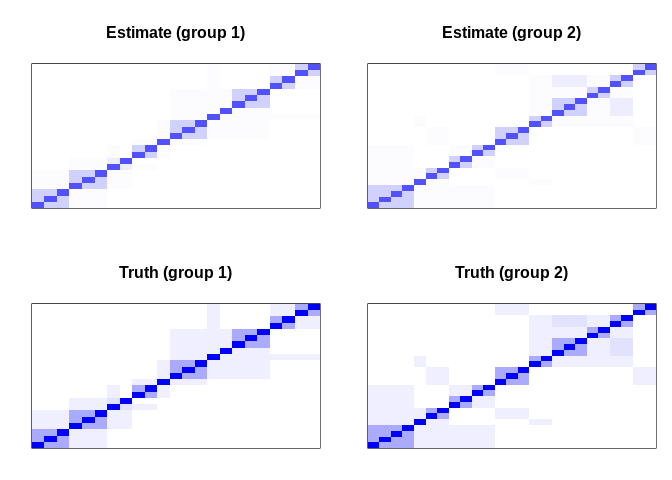
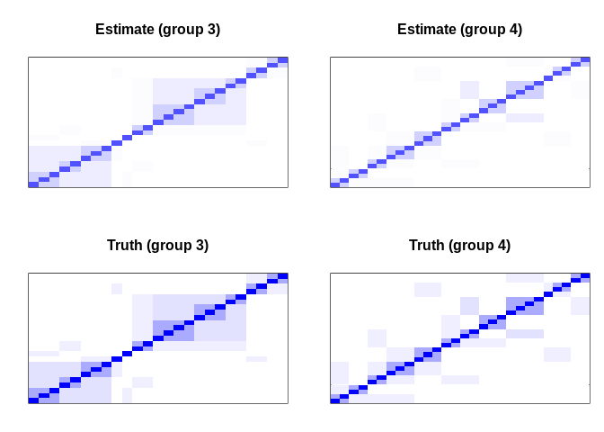

# survTMB

[](https://travis-ci.org/boennecd/survTMB)
<!-- [](https://www.r-pkg.org/badges/version/survTMB) -->
<!-- [](https://cran.r-project.org/package=survTMB) -->

This package contains methods to estimated mixed generalized survival
models (Liu, Pawitan, and Clements 2016, 2017). All methods use
automatic differentiation using the CppAD library (Bell 2019) through
[the TMB package](https://github.com/kaskr/adcomp) (Kristensen et al.
2016). The estimation methods are

  - a Laplace approximation using
    [TMB](https://github.com/kaskr/adcomp).
  - Gaussian variational approximation (GVA) similar to the method shown
    by Ormerod and Wand (2012).
  - Skew-normal variational approximation (SNVA) similar to the method
    shown by Ormerod (2011).

The [example](#example) section shows an example of how to use the
package with different methods. The [benchmark](#benchmark) section
shows a comparison of the computation time of the methods.

Joint marker and survival models are also available in the package. We
show an example of estimating a joint model in the [joint
models](#joint-models) section.

## Installation

The package can be installed from Github by calling:

``` r
library(remotes)
install_github("boennecd/psqn")    # we need the psqn package
install_github("boennecd/survTMB")
```

## Example

We estimate a GSM a below with the proportional odds (PO) link function
using both a Laplace approximation, a GVA, and a SNVA. First, we define
a function to perform the estimation.

``` r
# assign variable with data 
dat <- coxme::eortc

# assign function to estimate the model
library(survTMB)
#> Loading required package: splines
#> Loading required package: survival
library(survival)
fit_model <- function(link, n_threads = 2L, method = "Laplace", 
                      param_type = "DP", dense_hess = FALSE, 
                      sparse_hess = FALSE, do_fit = TRUE, 
                      do_free = FALSE)
  eval(bquote({
    adfun <- make_mgsm_ADFun(
      Surv(y, uncens) ~ trt, cluster = as.factor(center), 
      Z = ~ trt, df = 3L, data = dat, link = .(link), do_setup = .(method), 
      n_threads = .(n_threads), param_type = .(param_type), n_nodes = 15L, 
      dense_hess = .(dense_hess), sparse_hess = .(sparse_hess))
    fit <- if(.(do_fit))
      fit_mgsm(adfun, method = .(method)) else NULL
    if(.(do_free)){
      free_laplace(adfun)
      clear_cppad_mem(.(n_threads), keep_work_space = TRUE)
    }
    list(fit = fit, fun = adfun)
  }), parent.frame())

# # estimate the model using different methods. Start w/ Laplace
# (lap_ph <- fit_model("PO"))$fit

# w/ GVA
(gva_fit <- fit_model("PO", method = "GVA"))$fit
#> 
#> MGSM estimated with method 'GVA' with link 'PO' from call:
#>   make_mgsm_ADFun(formula = Surv(y, uncens) ~ trt, data = dat, 
#>       df = 3L, Z = ~trt, cluster = as.factor(center), do_setup = "GVA", 
#>       n_nodes = 15L, param_type = "DP", link = "PO", n_threads = 2L, 
#>       dense_hess = FALSE, sparse_hess = FALSE)
#>   fit_mgsm(object = adfun, method = "GVA")
#> 
#> Estimated fixed effects:
#>                             (Intercept)                                     trt 
#>                                   -8.05                                    1.03 
#> nsx(log(y), df = 3, intercept = FALSE)1 nsx(log(y), df = 3, intercept = FALSE)2 
#>                                    5.70                                   11.82 
#> nsx(log(y), df = 3, intercept = FALSE)3 
#>                                    5.59 
#> 
#> Estimated random effect covariance matrix (correlation matrix) is:
#>             (Intercept)    trt       (Intercept)   trt
#> (Intercept)      0.0446 0.0585             0.211 0.806
#> trt              0.0585 0.1181             0.806 0.344
#> (standard deviations are in the diagonal of the correlation matrix)
#> 
#> Estimated lower bound is -13031.10

# w/ SNVA
(snva_fit <- fit_model("PO", method = "SNVA", param_type = "DP"))$fit
#> 
#> MGSM estimated with method 'SNVA' with link 'PO' from call:
#>   make_mgsm_ADFun(formula = Surv(y, uncens) ~ trt, data = dat, 
#>       df = 3L, Z = ~trt, cluster = as.factor(center), do_setup = "SNVA", 
#>       n_nodes = 15L, param_type = "DP", link = "PO", n_threads = 2L, 
#>       dense_hess = FALSE, sparse_hess = FALSE)
#>   fit_mgsm(object = adfun, method = "SNVA")
#> 
#> Estimated fixed effects:
#>                             (Intercept)                                     trt 
#>                                   -8.05                                    1.03 
#> nsx(log(y), df = 3, intercept = FALSE)1 nsx(log(y), df = 3, intercept = FALSE)2 
#>                                    5.70                                   11.82 
#> nsx(log(y), df = 3, intercept = FALSE)3 
#>                                    5.59 
#> 
#> Estimated random effect covariance matrix (correlation matrix) is:
#>             (Intercept)    trt       (Intercept)   trt
#> (Intercept)      0.0446 0.0585             0.211 0.806
#> trt              0.0585 0.1182             0.806 0.344
#> (standard deviations are in the diagonal of the correlation matrix)
#> 
#> Estimated lower bound is -13031.10
```

### Computing the Hessian

The Hessian using a variational approximation (VA) can be computed as
both a dense matrix and as a sparse matrix. We show an example below
where we compare the two approaches.

``` r
library(microbenchmark) # needed for benchmarking
```

``` r
# fit model w/ GVA
fit <- fit_model("PO", method = "GVA", dense_hess = TRUE, 
                 sparse_hess = TRUE)

# compute dense Hessian
par <- with(fit$fit, c(params, va_params))
dense_hess <- fit$fun$gva$he(par)
num_hess <- numDeriv::jacobian(fit$fun$gva$gr, par)
all.equal(dense_hess, num_hess, tolerance = 1e-5)
#> [1] TRUE

# has many zeros (i.e. it is sparse)
mean(abs(dense_hess) > .Machine$double.eps) # fraction of non-zeros
#> [1] 0.102

# plot non-zero entries (black block's are non-zero; ignore upper triangle)
par(mar = c(1, 1, 1, 1))
is_non_zero <- t(abs(dense_hess) > .Machine$double.eps)
is_non_zero[upper.tri(is_non_zero)] <- FALSE
image(is_non_zero, xaxt = "n", yaxt = "n", 
      col = gray.colors(2, 1, 0))
```



``` r

# compute sparse Hessian
sparse_hess <- fit$fun$gva$he_sp(par)

# they are identical 
stopifnot(isTRUE(
  all.equal(as.matrix(sparse_hess), dense_hess, check.attributes = FALSE)))

# compare storage cost
as.numeric(object.size(dense_hess) / object.size(sparse_hess))
#> [1] 11

# we usually want the first part the inverse negative Hessian for the model 
# parameters. This can be computed as follows
library(Matrix)
n_vars <- length(fit$fit$params)
naiv_vcov <- function(hess)
  solve(hess)[1:n_vars, 1:n_vars]
alte_vcov <- function(hess){
  idx <- 1:n_vars
  A <- hess[ idx,  idx]
  C <- hess[-idx,  idx]
  D <- hess[-idx, -idx]
  solve(A - crossprod(C, solve(D, C)))
}

# these are the asymptotic standard deviations
structure(sqrt(diag(alte_vcov(dense_hess))), names = names(fit$fit$params))
#>                             (Intercept)                                     trt 
#>                                   0.420                                   0.109 
#> nsx(log(y), df = 3, intercept = FALSE)1 nsx(log(y), df = 3, intercept = FALSE)2 
#>                                   0.282                                   0.816 
#> nsx(log(y), df = 3, intercept = FALSE)3                                   theta 
#>                                   0.162                                   0.527 
#>                                   theta                                   theta 
#>                                   0.303                                   2.506

# check output is the same
stopifnot(
  isTRUE(all.equal(naiv_vcov(dense_hess), alte_vcov(dense_hess))),
  isTRUE(all.equal(naiv_vcov(dense_hess), as.matrix(alte_vcov(sparse_hess)), 
                   check.attributes = FALSE)),
  isTRUE(all.equal(naiv_vcov(dense_hess), as.matrix(naiv_vcov(sparse_hess)), 
                   check.attributes = FALSE)))

# compare computation time
microbenchmark(
  `Compute dense Hessian`               = fit$fun$gva$he(par), 
  `Compute sparse Hessian`              = fit$fun$gva$he_sp(par), 
  `Invert dense Hessian (naive)`        = naiv_vcov(dense_hess), 
  `Invert sparse Hessian (naive)`       = naiv_vcov(sparse_hess),
  `Invert dense Hessian (alternative)`  = alte_vcov(dense_hess), 
  `Invert sparse Hessian (alternative)` = alte_vcov(sparse_hess),
  times = 10)
#> Unit: milliseconds
#>                                 expr    min     lq   mean median     uq    max
#>                Compute dense Hessian 318.40 319.81 321.09 321.57 322.67 323.24
#>               Compute sparse Hessian  18.98  19.09  19.28  19.25  19.56  19.64
#>         Invert dense Hessian (naive)   5.14   5.28   5.30   5.32   5.35   5.41
#>        Invert sparse Hessian (naive)   1.02   1.05   1.16   1.11   1.28   1.40
#>   Invert dense Hessian (alternative)   1.30   1.32   1.35   1.35   1.36   1.45
#>  Invert sparse Hessian (alternative)   2.72   2.76   2.94   2.92   3.09   3.35
#>  neval
#>     10
#>     10
#>     10
#>     10
#>     10
#>     10
```

The sparse matrix only becomes more favorable for larger data sets (that
is, in terms of the number of clusters). However,
[recording](https://www.coin-or.org/CppAD/Doc/independent.htm) takes
some time and requires additional memory. We illustrate the additional
time below.

``` r
microbenchmark(
  `W/o Hessians     ` = fit_model("PO", method = "GVA", do_fit = FALSE), 
  `W/ dense Hessian ` = fit_model("PO", method = "GVA", do_fit = FALSE, 
                                  dense_hess = TRUE), 
  `W/ sparse Hessian` = fit_model("PO", method = "GVA", do_fit = FALSE, 
                                  sparse_hess = TRUE), 
  times = 10)
#> Unit: milliseconds
#>               expr   min    lq  mean median    uq   max neval
#>  W/o Hessians       27.6  28.1  29.1   28.3  30.8  31.5    10
#>  W/ dense Hessian   78.4  78.6  80.0   79.3  81.6  83.1    10
#>  W/ sparse Hessian 668.0 672.3 684.4  678.4 681.3 759.9    10
```

### Approximation of the Conditional Distribution

The variational parameters provide an approximation of the conditional
distribution given the data and parameters or the posterior in a
Bayesian view. As an example, we can look at the multivariate normal
distribution approximation which is made by the GVA for the first group
below.

``` r
va_params <- gva_fit$fit$va_params
is_this_group <- which(grepl("^g1:", names(va_params)))
n_random_effects <- 2L

# conditional mean of random effects
va_params[is_this_group][seq_len(n_random_effects)]
#> g1:mu1 g1:mu2 
#>  0.367  0.614

# conditional covariance matrix of random effects
theta_to_cov(va_params[is_this_group][-seq_len(n_random_effects)])
#>         [,1]    [,2]
#> [1,] 0.01314 0.00623
#> [2,] 0.00623 0.02920
```

We can compare this with the multivariate skew-normal distribution
approximation from the SNVA.

``` r
va_params <- snva_fit$fit$va_params
is_this_group <- which(grepl("^g1:", names(va_params)))
n_random_effects <- 2L

xi <- va_params[is_this_group][seq_len(n_random_effects)]
Psi <- head(tail(va_params[is_this_group], -n_random_effects), 
            -n_random_effects)
Psi <- theta_to_cov(Psi)
alpha <- tail(va_params[is_this_group], n_random_effects)

# conditional mean, covariance matrix, and Pearson's moment coefficient of 
# skewness
dp_to_cp(xi = xi, Psi = Psi, alpha = alpha)
#> $mu
#> g1:mu1 g1:mu2 
#>  0.367  0.614 
#> 
#> $Sigma
#>         [,1]    [,2]
#> [1,] 0.01314 0.00622
#> [2,] 0.00622 0.02920
#> 
#> $gamma
#> [1] -1e-04 -1e-04
```

from the default values possibly because the lower bound is quite flat
in these parameters in this area.

``` r
skews <- sapply(1:37, function(id){
  va_params <- snva_fit$fit$va_params
  is_this_group <- which(grepl(paste0("^g", id, ":"), names(va_params)))
  
  xi <- va_params[is_this_group][seq_len(n_random_effects)]
  Psi <- head(tail(va_params[is_this_group], -n_random_effects), 
              -n_random_effects)
  Psi <- theta_to_cov(Psi)
  alpha <- tail(va_params[is_this_group], n_random_effects)
  dp_to_cp(xi = xi, Psi = Psi, alpha = alpha)$gamma
})

apply(skews, 1L, quantile, probs = seq(0, 1, by = .25))
#>           [,1]      [,2]
#> 0%   -1.00e-04 -1.00e-04
#> 25%  -1.00e-04 -1.00e-04
#> 50%  -1.00e-04 -1.00e-04
#> 75%  -1.00e-04 -1.00e-04
#> 100% -9.99e-05 -9.99e-05
```

Again, the skewness parameter have not moved much from the defaults.

### Other link functions

We estimate the same model below with other link functions.

``` r
# ######
# # w/ Laplace
# fit_model("PH"    , do_free = TRUE)$fit
# fit_model("PO"    , do_free = TRUE)$fit
# fit_model("probit", do_free = TRUE)$fit

######
# w/ GVA
fit_model("PH"    , method = "GVA")$fit
#> 
#> MGSM estimated with method 'GVA' with link 'PH' from call:
#>   make_mgsm_ADFun(formula = Surv(y, uncens) ~ trt, data = dat, 
#>       df = 3L, Z = ~trt, cluster = as.factor(center), do_setup = "GVA", 
#>       n_nodes = 15L, param_type = "DP", link = "PH", n_threads = 2L, 
#>       dense_hess = FALSE, sparse_hess = FALSE)
#>   fit_mgsm(object = adfun, method = "GVA")
#> 
#> Estimated fixed effects:
#>                             (Intercept)                                     trt 
#>                                  -7.827                                   0.724 
#> nsx(log(y), df = 3, intercept = FALSE)1 nsx(log(y), df = 3, intercept = FALSE)2 
#>                                   5.394                                  11.390 
#> nsx(log(y), df = 3, intercept = FALSE)3 
#>                                   4.800 
#> 
#> Estimated random effect covariance matrix (correlation matrix) is:
#>             (Intercept)    trt       (Intercept)   trt
#> (Intercept)      0.0292 0.0256             0.171 0.640
#> trt              0.0256 0.0550             0.640 0.234
#> (standard deviations are in the diagonal of the correlation matrix)
#> 
#> Estimated lower bound is -13026.74
fit_model("PO"    , method = "GVA")$fit
#> 
#> MGSM estimated with method 'GVA' with link 'PO' from call:
#>   make_mgsm_ADFun(formula = Surv(y, uncens) ~ trt, data = dat, 
#>       df = 3L, Z = ~trt, cluster = as.factor(center), do_setup = "GVA", 
#>       n_nodes = 15L, param_type = "DP", link = "PO", n_threads = 2L, 
#>       dense_hess = FALSE, sparse_hess = FALSE)
#>   fit_mgsm(object = adfun, method = "GVA")
#> 
#> Estimated fixed effects:
#>                             (Intercept)                                     trt 
#>                                   -8.05                                    1.03 
#> nsx(log(y), df = 3, intercept = FALSE)1 nsx(log(y), df = 3, intercept = FALSE)2 
#>                                    5.70                                   11.82 
#> nsx(log(y), df = 3, intercept = FALSE)3 
#>                                    5.59 
#> 
#> Estimated random effect covariance matrix (correlation matrix) is:
#>             (Intercept)    trt       (Intercept)   trt
#> (Intercept)      0.0446 0.0585             0.211 0.806
#> trt              0.0585 0.1181             0.806 0.344
#> (standard deviations are in the diagonal of the correlation matrix)
#> 
#> Estimated lower bound is -13031.10
fit_model("probit", method = "GVA")$fit
#> 
#> MGSM estimated with method 'GVA' with link 'probit' from call:
#>   make_mgsm_ADFun(formula = Surv(y, uncens) ~ trt, data = dat, 
#>       df = 3L, Z = ~trt, cluster = as.factor(center), do_setup = "GVA", 
#>       n_nodes = 15L, param_type = "DP", link = "probit", n_threads = 2L, 
#>       dense_hess = FALSE, sparse_hess = FALSE)
#>   fit_mgsm(object = adfun, method = "GVA")
#> 
#> Estimated fixed effects:
#>                             (Intercept)                                     trt 
#>                                  -3.742                                   0.602 
#> nsx(log(y), df = 3, intercept = FALSE)1 nsx(log(y), df = 3, intercept = FALSE)2 
#>                                   2.660                                   5.004 
#> nsx(log(y), df = 3, intercept = FALSE)3 
#>                                   2.972 
#> 
#> Estimated random effect covariance matrix (correlation matrix) is:
#>             (Intercept)    trt       (Intercept)   trt
#> (Intercept)      0.0195 0.0149             0.140 0.513
#> trt              0.0149 0.0434             0.513 0.208
#> (standard deviations are in the diagonal of the correlation matrix)
#> 
#> Estimated lower bound is -13035.14

######
# w/ SNVA (DP: direct parameterization)
fit_model("PH"    , method = "SNVA", param_type = "DP")$fit
#> 
#> MGSM estimated with method 'SNVA' with link 'PH' from call:
#>   make_mgsm_ADFun(formula = Surv(y, uncens) ~ trt, data = dat, 
#>       df = 3L, Z = ~trt, cluster = as.factor(center), do_setup = "SNVA", 
#>       n_nodes = 15L, param_type = "DP", link = "PH", n_threads = 2L, 
#>       dense_hess = FALSE, sparse_hess = FALSE)
#>   fit_mgsm(object = adfun, method = "SNVA")
#> 
#> Estimated fixed effects:
#>                             (Intercept)                                     trt 
#>                                  -7.827                                   0.724 
#> nsx(log(y), df = 3, intercept = FALSE)1 nsx(log(y), df = 3, intercept = FALSE)2 
#>                                   5.394                                  11.390 
#> nsx(log(y), df = 3, intercept = FALSE)3 
#>                                   4.800 
#> 
#> Estimated random effect covariance matrix (correlation matrix) is:
#>             (Intercept)    trt       (Intercept)   trt
#> (Intercept)      0.0292 0.0256             0.171 0.638
#> trt              0.0256 0.0548             0.638 0.234
#> (standard deviations are in the diagonal of the correlation matrix)
#> 
#> Estimated lower bound is -13026.74
fit_model("PO"    , method = "SNVA", param_type = "DP")$fit
#> 
#> MGSM estimated with method 'SNVA' with link 'PO' from call:
#>   make_mgsm_ADFun(formula = Surv(y, uncens) ~ trt, data = dat, 
#>       df = 3L, Z = ~trt, cluster = as.factor(center), do_setup = "SNVA", 
#>       n_nodes = 15L, param_type = "DP", link = "PO", n_threads = 2L, 
#>       dense_hess = FALSE, sparse_hess = FALSE)
#>   fit_mgsm(object = adfun, method = "SNVA")
#> 
#> Estimated fixed effects:
#>                             (Intercept)                                     trt 
#>                                   -8.05                                    1.03 
#> nsx(log(y), df = 3, intercept = FALSE)1 nsx(log(y), df = 3, intercept = FALSE)2 
#>                                    5.70                                   11.82 
#> nsx(log(y), df = 3, intercept = FALSE)3 
#>                                    5.59 
#> 
#> Estimated random effect covariance matrix (correlation matrix) is:
#>             (Intercept)    trt       (Intercept)   trt
#> (Intercept)      0.0446 0.0585             0.211 0.806
#> trt              0.0585 0.1182             0.806 0.344
#> (standard deviations are in the diagonal of the correlation matrix)
#> 
#> Estimated lower bound is -13031.10
fit_model("probit", method = "SNVA", param_type = "DP")$fit
#> 
#> MGSM estimated with method 'SNVA' with link 'probit' from call:
#>   make_mgsm_ADFun(formula = Surv(y, uncens) ~ trt, data = dat, 
#>       df = 3L, Z = ~trt, cluster = as.factor(center), do_setup = "SNVA", 
#>       n_nodes = 15L, param_type = "DP", link = "probit", n_threads = 2L, 
#>       dense_hess = FALSE, sparse_hess = FALSE)
#>   fit_mgsm(object = adfun, method = "SNVA")
#> 
#> Estimated fixed effects:
#>                             (Intercept)                                     trt 
#>                                  -3.742                                   0.602 
#> nsx(log(y), df = 3, intercept = FALSE)1 nsx(log(y), df = 3, intercept = FALSE)2 
#>                                   2.660                                   5.004 
#> nsx(log(y), df = 3, intercept = FALSE)3 
#>                                   2.973 
#> 
#> Estimated random effect covariance matrix (correlation matrix) is:
#>             (Intercept)    trt       (Intercept)   trt
#> (Intercept)      0.0195 0.0149             0.140 0.513
#> trt              0.0149 0.0434             0.513 0.208
#> (standard deviations are in the diagonal of the correlation matrix)
#> 
#> Estimated lower bound is -13035.14

######
# w/ SNVA (CP: centralized parameterization)
fit_model("PH"    , method = "SNVA", param_type = "CP_trans")$fit
#> 
#> MGSM estimated with method 'SNVA' with link 'PH' from call:
#>   make_mgsm_ADFun(formula = Surv(y, uncens) ~ trt, data = dat, 
#>       df = 3L, Z = ~trt, cluster = as.factor(center), do_setup = "SNVA", 
#>       n_nodes = 15L, param_type = "CP_trans", link = "PH", n_threads = 2L, 
#>       dense_hess = FALSE, sparse_hess = FALSE)
#>   fit_mgsm(object = adfun, method = "SNVA")
#> 
#> Estimated fixed effects:
#>                             (Intercept)                                     trt 
#>                                  -7.827                                   0.724 
#> nsx(log(y), df = 3, intercept = FALSE)1 nsx(log(y), df = 3, intercept = FALSE)2 
#>                                   5.394                                  11.390 
#> nsx(log(y), df = 3, intercept = FALSE)3 
#>                                   4.800 
#> 
#> Estimated random effect covariance matrix (correlation matrix) is:
#>             (Intercept)    trt       (Intercept)   trt
#> (Intercept)      0.0292 0.0256             0.171 0.638
#> trt              0.0256 0.0548             0.638 0.234
#> (standard deviations are in the diagonal of the correlation matrix)
#> 
#> Estimated lower bound is -13026.74
fit_model("PO"    , method = "SNVA", param_type = "CP_trans")$fit
#> 
#> MGSM estimated with method 'SNVA' with link 'PO' from call:
#>   make_mgsm_ADFun(formula = Surv(y, uncens) ~ trt, data = dat, 
#>       df = 3L, Z = ~trt, cluster = as.factor(center), do_setup = "SNVA", 
#>       n_nodes = 15L, param_type = "CP_trans", link = "PO", n_threads = 2L, 
#>       dense_hess = FALSE, sparse_hess = FALSE)
#>   fit_mgsm(object = adfun, method = "SNVA")
#> 
#> Estimated fixed effects:
#>                             (Intercept)                                     trt 
#>                                   -8.05                                    1.03 
#> nsx(log(y), df = 3, intercept = FALSE)1 nsx(log(y), df = 3, intercept = FALSE)2 
#>                                    5.70                                   11.82 
#> nsx(log(y), df = 3, intercept = FALSE)3 
#>                                    5.59 
#> 
#> Estimated random effect covariance matrix (correlation matrix) is:
#>             (Intercept)    trt       (Intercept)   trt
#> (Intercept)      0.0446 0.0585             0.211 0.806
#> trt              0.0585 0.1182             0.806 0.344
#> (standard deviations are in the diagonal of the correlation matrix)
#> 
#> Estimated lower bound is -13031.10
fit_model("probit", method = "SNVA", param_type = "CP_trans")$fit
#> 
#> MGSM estimated with method 'SNVA' with link 'probit' from call:
#>   make_mgsm_ADFun(formula = Surv(y, uncens) ~ trt, data = dat, 
#>       df = 3L, Z = ~trt, cluster = as.factor(center), do_setup = "SNVA", 
#>       n_nodes = 15L, param_type = "CP_trans", link = "probit", 
#>       n_threads = 2L, dense_hess = FALSE, sparse_hess = FALSE)
#>   fit_mgsm(object = adfun, method = "SNVA")
#> 
#> Estimated fixed effects:
#>                             (Intercept)                                     trt 
#>                                  -3.742                                   0.602 
#> nsx(log(y), df = 3, intercept = FALSE)1 nsx(log(y), df = 3, intercept = FALSE)2 
#>                                   2.660                                   5.004 
#> nsx(log(y), df = 3, intercept = FALSE)3 
#>                                   2.973 
#> 
#> Estimated random effect covariance matrix (correlation matrix) is:
#>             (Intercept)    trt       (Intercept)   trt
#> (Intercept)      0.0195 0.0149             0.140 0.513
#> trt              0.0149 0.0434             0.513 0.208
#> (standard deviations are in the diagonal of the correlation matrix)
#> 
#> Estimated lower bound is -13035.14
```

## Benchmark

We provide a benchmark of the estimation methods used in section
[example](#example) below.

``` r
clear_cppad_mem(4L)
#> [1] 1
```

``` r
for(mth in c("GVA")){
# for(mth in c("Laplace", "GVA")){
  msg <- sprintf("Method: %s", mth)
  cat(sprintf("\n%s\n%s\n", msg, 
              paste0(rep("-", nchar(msg)), collapse = "")))
  print(microbenchmark(
    `PH         ` = fit_model("PH"    , 1L, mth, do_free = TRUE),
    `PH     (2L)` = fit_model("PH"    , 2L, mth, do_free = TRUE),
    `PH     (4L)` = fit_model("PH"    , 4L, mth, do_free = TRUE),
    
    `PO         ` = fit_model("PO"    , 1L, mth, do_free = TRUE),
    `PO     (2L)` = fit_model("PO"    , 2L, mth, do_free = TRUE),
    `PO     (4L)` = fit_model("PO"    , 4L, mth, do_free = TRUE), 
    
    `probit     ` = fit_model("probit", 1L, mth, do_free = TRUE),
    `probit (2L)` = fit_model("probit", 2L, mth, do_free = TRUE),
    `probit (4L)` = fit_model("probit", 4L, mth, do_free = TRUE),
    times = 5))
}
#> 
#> Method: GVA
#> -----------
#> Unit: milliseconds
#>         expr   min    lq mean median    uq   max neval
#>  PH          174.6 178.6  178  179.0 179.4 179.7     5
#>  PH     (2L) 110.9 112.5  113  112.9 114.9 115.0     5
#>  PH     (4L)  84.9  84.9   86   86.5  86.6  87.1     5
#>  PO          567.5 569.5  571  571.7 571.9 575.7     5
#>  PO     (2L) 333.8 335.8  337  336.3 337.6 340.0     5
#>  PO     (4L) 226.7 226.9  228  228.2 229.5 230.9     5
#>  probit      710.7 711.2  712  711.2 713.5 715.1     5
#>  probit (2L) 414.0 414.8  416  415.6 416.3 418.2     5
#>  probit (4L) 278.1 280.4  299  281.8 282.2 373.3     5
```

``` r
for(param_type in c("DP", "CP_trans")){
  mth <- "SNVA"
  msg <- sprintf("Method: %s (%s)", mth, param_type)
  cat(sprintf("\n%s\n%s\n", msg, 
              paste0(rep("-", nchar(msg)), collapse = "")))
  print(suppressWarnings(microbenchmark(
    `PH         ` = fit_model("PH"    , 1L, mth, param_type = param_type),
    `PH     (2L)` = fit_model("PH"    , 2L, mth, param_type = param_type),
    `PH     (4L)` = fit_model("PH"    , 4L, mth, param_type = param_type),
    
    `PO         ` = fit_model("PO"    , 1L, mth, param_type = param_type),
    `PO     (2L)` = fit_model("PO"    , 2L, mth, param_type = param_type),
    `PO     (4L)` = fit_model("PO"    , 4L, mth, param_type = param_type), 
    
    `probit     ` = fit_model("probit", 1L, mth, param_type = param_type),
    `probit (2L)` = fit_model("probit", 2L, mth, param_type = param_type),
    `probit (4L)` = fit_model("probit", 4L, mth, param_type = param_type),
    times = 5)))
}
#> 
#> Method: SNVA (DP)
#> -----------------
#> Unit: milliseconds
#>         expr min  lq mean median  uq max neval
#>  PH          217 218  219    218 221 222     5
#>  PH     (2L) 137 137  140    138 141 145     5
#>  PH     (4L) 102 104  108    105 112 115     5
#>  PO          736 742  747    744 753 760     5
#>  PO     (2L) 433 442  447    449 453 457     5
#>  PO     (4L) 304 305  307    306 307 314     5
#>  probit      918 927  930    932 934 939     5
#>  probit (2L) 545 546  549    549 550 556     5
#>  probit (4L) 362 366  370    371 375 377     5
#> 
#> Method: SNVA (CP_trans)
#> -----------------------
#> Unit: milliseconds
#>         expr min  lq mean median  uq max neval
#>  PH          287 288  291    291 291 296     5
#>  PH     (2L) 179 181  182    182 182 188     5
#>  PH     (4L) 137 138  140    140 141 142     5
#>  PO          745 749  751    750 751 760     5
#>  PO     (2L) 446 446  449    448 453 453     5
#>  PO     (4L) 302 305  324    311 312 392     5
#>  probit      924 924  931    934 935 938     5
#>  probit (2L) 541 543  546    544 546 553     5
#>  probit (4L) 368 370  372    372 376 377     5
```

### Using the psqn Interface

Another option is to use [the psqn
package](https://github.com/boennecd/psqn) through this package. This
can be done as follows

``` r
# get the object needed to perform the estimation 
psqn_obj <- make_mgsm_psqn_obj(
  formula = Surv(y, uncens) ~ trt, data = dat, 
  df = 3L, Z = ~trt, cluster = as.factor(center), do_setup = "SNVA", 
  n_nodes = 15L, link = "PO", n_threads = 2L)

# perform the estimation
psqn_opt <- optim_mgsm_psqn(psqn_obj)

# check that the function value is the same
all.equal(psqn_opt$value, snva_fit$fit$optim$value)
#> [1] "Mean relative difference: 8.27e-07"
```

It is a bit slower in this case as shown below but can be faster when
there are more clusters.

``` r
microbenchmark(`Using psqn` = { 
  psqn_obj <- make_mgsm_psqn_obj(
    formula = Surv(y, uncens) ~ trt, data = dat, 
    df = 3L, Z = ~trt, cluster = as.factor(center), do_setup = "SNVA", 
    n_nodes = 15L, link = "PO", n_threads = 2L)
  optim_mgsm_psqn(psqn_obj)
}, times = 5)
#> Unit: milliseconds
#>        expr min  lq mean median  uq max neval
#>  Using psqn 646 649  651    651 652 655     5
```

## Joint Models

We will use one of the test data sets in the
[inst/test-data](inst/test-data) directory. The data is generated with
the [inst/test-data/gen-test-data.R](inst/test-data/gen-test-data.R)
file which is available on Github. The file uses the
[SimSurvNMarker](https://github.com/boennecd/SimSurvNMarker) package to
simulate a data set. The model is simulated
from

<!-- $$\begin{align*} -->

<!-- \vec Y_{ij} \mid \vec U_i = \vec u_i -->

<!--   &\sim N^{(r)}(\vec \mu_i(s_{ij}, \vec u_i), \Sigma) -->

<!--   \\ -->

<!-- \vec\mu(s, \vec u) &= -->

<!--   \Gamma^\top \vec x_i + B^\top\vec g(s) + U^\top\vec m(s) -->

<!--   \\ -->

<!-- &= \left(I \otimes \vec x_i^\top\right)\text{vec}\Gamma -->

<!--      + \left(I \otimes \vec g(s)^\top\right)\text{vec} B -->

<!--      + \left(I \otimes \vec m(s)^\top\right) \vec u -->

<!--   \\ -->

<!-- \vec U_i &\sim N^{(K)}(\vec 0, \Psi) -->

<!--   \\ -->

<!-- h(t\mid \vec u) &= \exp\left( -->

<!--   \vec\omega^\top\vec b(t) + -->

<!--   \vec z_i^\top\vec\delta + -->

<!--   \vec\alpha^\top\vec\mu(t, \vec u) -->

<!--   \right) -->

<!--   \\ -->

<!-- &= \exp\Bigg( -->

<!--   \vec\omega^\top\vec b(t) + -->

<!--   \vec z_i^\top\vec\delta -->

<!--   + \vec 1^\top\left( -->

<!--   \text{diag}(\vec \alpha) \otimes \vec x_i^\top\right)\text{vec}\Gamma -->

<!--   + \vec 1^\top\left( -->

<!--   \text{diag}(\vec \alpha) \otimes \vec g(t)^\top\right)\text{vec} B \\ -->

<!-- &\hspace{50pt}+ \vec 1^\top\left( -->

<!--   \text{diag}(\vec \alpha) \otimes \vec m(t)^\top\right)\vec u -->

<!--   \Bigg) -->

<!-- \end{align*}$$ -->

  
![\\begin{align\*} \\vec Y\_{ij} \\mid \\vec U\_i = \\vec u\_i &\\sim
N^{(r)}(\\vec \\mu\_i(s\_{ij}, \\vec u\_i), \\Sigma) \\\\ \\vec\\mu(s,
\\vec u) &= \\Gamma^\\top \\vec x\_i + B^\\top\\vec g(s) + U^\\top\\vec
m(s) \\\\ &= \\left(I \\otimes \\vec
x\_i^\\top\\right)\\text{vec}\\Gamma + \\left(I \\otimes \\vec
g(s)^\\top\\right)\\text{vec} B + \\left(I \\otimes \\vec
m(s)^\\top\\right) \\vec u \\\\ \\vec U\_i &\\sim N^{(K)}(\\vec 0,
\\Psi) \\\\ h(t\\mid \\vec u) &= \\exp\\left( \\vec\\omega^\\top\\vec
b(t) + \\vec z\_i^\\top\\vec\\delta + \\vec\\alpha^\\top\\vec\\mu(t,
\\vec u) \\right) \\\\ &= \\exp\\Bigg( \\vec\\omega^\\top\\vec b(t) +
\\vec z\_i^\\top\\vec\\delta + \\vec 1^\\top\\left( \\text{diag}(\\vec
\\alpha) \\otimes \\vec x\_i^\\top\\right)\\text{vec}\\Gamma +
\\vec 1^\\top\\left( \\text{diag}(\\vec \\alpha) \\otimes \\vec
g(t)^\\top\\right)\\text{vec} B \\\\ &\\hspace{50pt}+
\\vec 1^\\top\\left( \\text{diag}(\\vec \\alpha) \\otimes \\vec
m(t)^\\top\\right)\\vec u \\Bigg)
\\end{align\*}](https://latex.codecogs.com/svg.latex?%5Cbegin%7Balign%2A%7D%20%20%5Cvec%20Y_%7Bij%7D%20%5Cmid%20%5Cvec%20U_i%20%3D%20%5Cvec%20u_i%20%20%20%20%26%5Csim%20N%5E%7B%28r%29%7D%28%5Cvec%20%5Cmu_i%28s_%7Bij%7D%2C%20%5Cvec%20u_i%29%2C%20%5CSigma%29%20%20%20%20%5C%5C%20%20%5Cvec%5Cmu%28s%2C%20%5Cvec%20u%29%20%26%3D%20%20%20%20%5CGamma%5E%5Ctop%20%5Cvec%20x_i%20%2B%20B%5E%5Ctop%5Cvec%20g%28s%29%20%2B%20U%5E%5Ctop%5Cvec%20m%28s%29%20%20%20%20%5C%5C%20%20%26%3D%20%5Cleft%28I%20%5Cotimes%20%5Cvec%20x_i%5E%5Ctop%5Cright%29%5Ctext%7Bvec%7D%5CGamma%20%20%20%20%20%20%20%2B%20%5Cleft%28I%20%5Cotimes%20%5Cvec%20g%28s%29%5E%5Ctop%5Cright%29%5Ctext%7Bvec%7D%20B%20%20%20%20%20%20%20%2B%20%5Cleft%28I%20%5Cotimes%20%5Cvec%20m%28s%29%5E%5Ctop%5Cright%29%20%5Cvec%20u%20%20%20%20%5C%5C%20%20%5Cvec%20U_i%20%26%5Csim%20N%5E%7B%28K%29%7D%28%5Cvec%200%2C%20%5CPsi%29%20%20%20%20%5C%5C%20%20h%28t%5Cmid%20%5Cvec%20u%29%20%26%3D%20%5Cexp%5Cleft%28%20%20%20%20%5Cvec%5Comega%5E%5Ctop%5Cvec%20b%28t%29%20%2B%20%20%20%20%5Cvec%20z_i%5E%5Ctop%5Cvec%5Cdelta%20%2B%20%20%20%20%5Cvec%5Calpha%5E%5Ctop%5Cvec%5Cmu%28t%2C%20%5Cvec%20u%29%20%20%20%20%5Cright%29%20%20%20%20%5C%5C%20%20%26%3D%20%5Cexp%5CBigg%28%20%20%20%20%5Cvec%5Comega%5E%5Ctop%5Cvec%20b%28t%29%20%2B%20%20%20%20%5Cvec%20z_i%5E%5Ctop%5Cvec%5Cdelta%20%20%20%20%2B%20%5Cvec%201%5E%5Ctop%5Cleft%28%20%20%20%20%5Ctext%7Bdiag%7D%28%5Cvec%20%5Calpha%29%20%5Cotimes%20%5Cvec%20x_i%5E%5Ctop%5Cright%29%5Ctext%7Bvec%7D%5CGamma%20%20%20%20%2B%20%5Cvec%201%5E%5Ctop%5Cleft%28%20%20%20%20%5Ctext%7Bdiag%7D%28%5Cvec%20%5Calpha%29%20%5Cotimes%20%5Cvec%20g%28t%29%5E%5Ctop%5Cright%29%5Ctext%7Bvec%7D%20B%20%5C%5C%20%20%26%5Chspace%7B50pt%7D%2B%20%5Cvec%201%5E%5Ctop%5Cleft%28%20%20%20%20%5Ctext%7Bdiag%7D%28%5Cvec%20%5Calpha%29%20%5Cotimes%20%5Cvec%20m%28t%29%5E%5Ctop%5Cright%29%5Cvec%20u%20%20%20%20%5CBigg%29%20%20%5Cend%7Balign%2A%7D
"\\begin{align*}  \\vec Y_{ij} \\mid \\vec U_i = \\vec u_i    &\\sim N^{(r)}(\\vec \\mu_i(s_{ij}, \\vec u_i), \\Sigma)    \\\\  \\vec\\mu(s, \\vec u) &=    \\Gamma^\\top \\vec x_i + B^\\top\\vec g(s) + U^\\top\\vec m(s)    \\\\  &= \\left(I \\otimes \\vec x_i^\\top\\right)\\text{vec}\\Gamma       + \\left(I \\otimes \\vec g(s)^\\top\\right)\\text{vec} B       + \\left(I \\otimes \\vec m(s)^\\top\\right) \\vec u    \\\\  \\vec U_i &\\sim N^{(K)}(\\vec 0, \\Psi)    \\\\  h(t\\mid \\vec u) &= \\exp\\left(    \\vec\\omega^\\top\\vec b(t) +    \\vec z_i^\\top\\vec\\delta +    \\vec\\alpha^\\top\\vec\\mu(t, \\vec u)    \\right)    \\\\  &= \\exp\\Bigg(    \\vec\\omega^\\top\\vec b(t) +    \\vec z_i^\\top\\vec\\delta    + \\vec 1^\\top\\left(    \\text{diag}(\\vec \\alpha) \\otimes \\vec x_i^\\top\\right)\\text{vec}\\Gamma    + \\vec 1^\\top\\left(    \\text{diag}(\\vec \\alpha) \\otimes \\vec g(t)^\\top\\right)\\text{vec} B \\\\  &\\hspace{50pt}+ \\vec 1^\\top\\left(    \\text{diag}(\\vec \\alpha) \\otimes \\vec m(t)^\\top\\right)\\vec u    \\Bigg)  \\end{align*}")  

where  is individual
’s
th observed marker at
time ,  is individual
’s random effect, and
 is the instantaneous
hazard rate for the time-to-event outcome.
 is the so-called association parameter. It shows the
strength of the relation between the latent mean function,
"), and the log of the instantaneous rate,
"). "), ") and ") are basis expansions of time. As an example, these can be
a polynomial, a B-spline, or a natural cubic spline. The expansion for
the baseline hazard, "), is typically made on  instead of
. One reason is that the
model reduces to a Weibull distribution when a first polynomial is used
and .  and
 are individual specific known covariates.

We start by loading the simulated data set.

``` r
dat <- readRDS(file.path("inst", "test-data", "large-joint-all.RDS"))

# the marker data
m_data <- dat$marker_data
head(m_data, 10)
#>    obs_time      Y1      Y2 X1 id
#> 1     2.358 -0.0313 -1.4347  1  1
#> 2     1.941 -1.6829  0.0705  0  2
#> 3     2.469 -1.1793 -0.2994  0  2
#> 4     0.679  0.5640 -0.4988  0  3
#> 5     0.633 -1.0614  0.1318  0  4
#> 6     0.704 -0.9367 -0.4324  0  4
#> 7     0.740 -0.6472  0.0842  0  4
#> 8     0.989 -1.0603  0.4740  0  4
#> 9     1.291 -0.5059  0.4103  0  4
#> 10    2.404 -0.6974  0.2074  0  4

# the survival data
s_data <- dat$survival_data
head(s_data, 10)
#>    Z1 Z2 left_trunc     y event id
#> 1   0  1      2.198 2.905  TRUE  1
#> 2   0  0      0.107 3.350  TRUE  2
#> 3   0  1      0.593 0.797  TRUE  3
#> 4   1  1      0.279 2.507  TRUE  4
#> 5   0  0      2.062 4.669  TRUE  5
#> 6   1  1      2.215 8.058 FALSE  6
#> 7   1  0      1.061 9.123 FALSE  7
#> 8   1  1      0.214 8.894 FALSE  8
#> 9   1  1      1.106 7.498 FALSE  9
#> 10  1  0      1.237 1.734  TRUE 10
```

There is

``` r
length(unique(s_data$id))
#> [1] 1000
length(unique(s_data$id)) == NROW(s_data) # one row per id
#> [1] TRUE
```

individuals who each has an average of

``` r
NROW(m_data) / length(unique(s_data$id))
#> [1] 3.74
```

observed markers. The data is simulated. Thus, we know the true
parameters. These are

``` r
dat$params[c("gamma", "B", "Psi", "omega", "delta", "alpha", "sigma")]
#> $gamma
#>      [,1] [,2]
#> [1,] 0.14 -0.8
#> 
#> $B
#>       [,1]  [,2]
#> [1,] -0.96  0.26
#> [2,]  0.33 -0.76
#> [3,]  0.39  0.19
#> 
#> $Psi
#>       [,1]  [,2]  [,3]  [,4]
#> [1,]  1.57 -0.37 -0.08 -0.17
#> [2,] -0.37  0.98 -0.05  0.09
#> [3,] -0.08 -0.05  0.87  0.53
#> [4,] -0.17  0.09  0.53  1.17
#> 
#> $omega
#> [1] -2.60 -1.32
#> 
#> $delta
#> [1]  0.20 -0.17
#> 
#> $alpha
#> [1]  0.32 -0.31
#> 
#> $sigma
#>      [,1] [,2]
#> [1,] 0.03 0.00
#> [2,] 0.00 0.05
```

We start by constructing the objective function in order to estimate the
model.

``` r
system.time(
  out <- make_joint_ADFun(
    sformula =  Surv(left_trunc, y, event) ~ Z1 + Z2, 
    mformula = cbind(Y1, Y2) ~ X1, 
    id_var = id, time_var = obs_time, 
    sdata = s_data, mdata = m_data, m_coefs = dat$params$m_attr$knots,
    s_coefs = dat$params$b_attr$knots, g_coefs = dat$params$g_attr$knots, 
    n_nodes = 30L, n_threads = 6L))
#>    user  system elapsed 
#>  29.524   0.016   7.259
```

Next, we fit the model using the default optimization function.

``` r
library(lbfgs)
system.time(
  opt_out <- lbfgs(out$fn, out$gr, out$par, max_iterations = 25000L, 
                   past = 100L, delta = sqrt(.Machine$double.eps), 
                   invisible = 1))
#>    user  system elapsed 
#>   166.7     0.0    27.8
```

The estimated lower bound of the log marginal likelihood at the optimum
is shown
below.

<!-- with(environment(out$fn), c(mark$ll, sr_dat$ll, mark$ll + sr_dat$ll)) -->

``` r
-opt_out$value
#> [1] -4124
```

Further, we can compare the estimated model parameters with the true
model parameters as follows.

``` r
names(opt_out$par) <- names(out$par)
true_params <- with(dat$params, c(
  gamma, B, cov_to_theta(Psi), cov_to_theta(sigma),
  delta, omega, alpha))
n_params <- length(true_params)
names(true_params) <- names(out$par)[seq_along(true_params)]
rbind(Estimate = opt_out$par[1:n_params], 
      `True value` = true_params)
#>            gamma:X1.Y1 gamma:X1.Y2 B:g1.Y1 B:g2.Y1 B:g3.Y1 B:g1.Y2 B:g2.Y2
#> Estimate         0.133      -0.802  -0.941    0.37   0.404   0.253  -0.848
#> True value       0.140      -0.800  -0.960    0.33   0.390   0.260  -0.760
#>            B:g3.Y2 Psi:L1.1 Psi:L2.1 Psi:L3.1 Psi:L4.1 Psi:L2.2 Psi:L3.2
#> Estimate    0.0623    0.238   -0.298  -0.1180   -0.229  -0.0370  -0.1161
#> True value  0.1900    0.226   -0.295  -0.0638   -0.136  -0.0567  -0.0729
#>            Psi:L4.2 Psi:L3.3 Psi:L4.3 Psi:L4.4 Sigma:L1.1 Sigma:L2.1 Sigma:L2.2
#> Estimate    -0.0235  -0.1274    0.546  -0.0904      -1.76    0.00305      -1.53
#> True value   0.0528  -0.0751    0.566  -0.0942      -1.75    0.00000      -1.50
#>            delta:Z1 delta:Z2 omega:b1 omega:b2 alpha:Y1 alpha:Y2
#> Estimate      0.238   -0.219    -2.51    -1.25    0.338   -0.276
#> True value    0.200   -0.170    -2.60    -1.32    0.320   -0.310
```

Next, we compare the estimated covariance matrix of the random effects
with the true
values.

``` r
# random effect covariance matrix (first estimated and then the true values)
is_psi <- which(grepl("Psi", names(true_params)))
theta_to_cov(opt_out$par[is_psi]) 
#>        [,1]    [,2]    [,3]    [,4]
#> [1,]  1.609 -0.3785 -0.1497 -0.2903
#> [2,] -0.379  1.0178 -0.0767  0.0457
#> [3,] -0.150 -0.0767  0.8025  0.5108
#> [4,] -0.290  0.0457  0.5108  1.1861
dat$params$Psi
#>       [,1]  [,2]  [,3]  [,4]
#> [1,]  1.57 -0.37 -0.08 -0.17
#> [2,] -0.37  0.98 -0.05  0.09
#> [3,] -0.08 -0.05  0.87  0.53
#> [4,] -0.17  0.09  0.53  1.17
cov2cor(theta_to_cov(opt_out$par[is_psi]))
#>        [,1]    [,2]    [,3]    [,4]
#> [1,]  1.000 -0.2958 -0.1317 -0.2101
#> [2,] -0.296  1.0000 -0.0848  0.0416
#> [3,] -0.132 -0.0848  1.0000  0.5236
#> [4,] -0.210  0.0416  0.5236  1.0000
cov2cor(dat$params$Psi)
#>         [,1]    [,2]    [,3]   [,4]
#> [1,]  1.0000 -0.2983 -0.0685 -0.125
#> [2,] -0.2983  1.0000 -0.0541  0.084
#> [3,] -0.0685 -0.0541  1.0000  0.525
#> [4,] -0.1254  0.0840  0.5253  1.000
```

Further, we compare the estimated covariance matrix of the noise with
the true values.

``` r
# noise covariance matrix (first estimated and then the true values)
is_sigma <- which(grepl("Sigma", names(true_params)))
theta_to_cov(opt_out$par[is_sigma])
#>          [,1]     [,2]
#> [1,] 0.029378 0.000522
#> [2,] 0.000522 0.047151
dat$params$sigma
#>      [,1] [,2]
#> [1,] 0.03 0.00
#> [2,] 0.00 0.05
cov2cor(theta_to_cov(opt_out$par[is_sigma]))
#>       [,1]  [,2]
#> [1,] 1.000 0.014
#> [2,] 0.014 1.000
cov2cor(dat$params$sigma)
#>      [,1] [,2]
#> [1,]    1    0
#> [2,]    0    1
```

We can look at quantiles of mean, standard deviations, and Pearson’s
moment coefficient of skewness for each individuals estimated
variational distribution as follows.

``` r
va_stats <- lapply(1:1000, function(id){
  is_grp_x <- which(grepl(paste0("^g", id, ":"), names(opt_out$par)))
  x_va_pars <- opt_out$par[is_grp_x]
  xi <- x_va_pars[grepl(":xi", names(x_va_pars))]
  Lambda <- theta_to_cov(
    x_va_pars[grepl(":(log_sd|L)", names(x_va_pars))])
  alpha <- x_va_pars[grepl(":alpha", names(x_va_pars))]
  
  dp_to_cp(xi = xi, Psi = Lambda, alpha = alpha)
})

sum_func <- function(x)
  apply(x, 2L, quantile, probs = seq(0, 1, by = .1))

# mean 
sum_func(do.call(rbind, lapply(va_stats, `[[`, "mu")))
#>       g1:xi1  g1:xi2  g1:xi3  g1:xi4
#> 0%   -3.4764 -3.6411 -2.3680 -2.7734
#> 10%  -1.4589 -0.9492 -0.8209 -0.9567
#> 20%  -1.0029 -0.6333 -0.4897 -0.5622
#> 30%  -0.6412 -0.3940 -0.2887 -0.3403
#> 40%  -0.3155 -0.1928 -0.1421 -0.1615
#> 50%  -0.0283 -0.0134 -0.0043 -0.0133
#> 60%   0.2932  0.1935  0.1246  0.1377
#> 70%   0.5998  0.3900  0.2755  0.3078
#> 80%   0.9928  0.5970  0.4698  0.5532
#> 90%   1.5259  1.0167  0.8506  0.9636
#> 100%  3.9393  2.9902  2.3182  2.6445

# standard deviation
sum_func(do.call(rbind, lapply(va_stats, 
                               function(x) sqrt(diag(x[["Sigma"]])))))
#>        [,1]  [,2]  [,3]  [,4]
#> 0%   0.0852 0.107 0.107 0.135
#> 10%  0.1287 0.236 0.160 0.295
#> 20%  0.1646 0.336 0.204 0.416
#> 30%  0.2268 0.463 0.280 0.568
#> 40%  0.3357 0.623 0.429 0.789
#> 50%  0.4583 0.665 0.602 0.852
#> 60%  0.5425 0.686 0.708 0.894
#> 70%  0.6036 0.710 0.778 0.930
#> 80%  0.6489 0.739 0.821 0.978
#> 90%  0.6877 0.781 0.848 1.024
#> 100% 0.7310 1.002 0.872 1.069

# skewness
skews <-  sum_func(do.call(rbind, lapply(va_stats, `[[`, "gamma")))
skews[] <- sprintf("%8.4f", skews)
print(skews, quote = FALSE)
#>      [,1]     [,2]     [,3]     [,4]    
#> 0%    -0.0053  -0.0053  -0.0031  -0.0031
#> 10%   -0.0008  -0.0008  -0.0001  -0.0001
#> 20%   -0.0006  -0.0006  -0.0001  -0.0001
#> 30%   -0.0006  -0.0006  -0.0001  -0.0001
#> 40%   -0.0006  -0.0005  -0.0001  -0.0001
#> 50%   -0.0005  -0.0005  -0.0000  -0.0000
#> 60%   -0.0005  -0.0004  -0.0000  -0.0000
#> 70%   -0.0004  -0.0004  -0.0000  -0.0000
#> 80%   -0.0003  -0.0002  -0.0000  -0.0000
#> 90%   -0.0001  -0.0001  -0.0000   0.0000
#> 100%   0.0000   0.0001   0.0003   0.0004
```

We only see a low amount of
skewness.

## Pedigree Data

<!-- $$\begin{align*}  -->

<!-- g(S(t\mid \vec x_{ij}, \epsilon_{ij})) &=  -->

<!--   \vec\omega^\top\vec f(t) + \vec\beta^\top\vec x_{ij} +\epsilon_{ij} \\ -->

<!-- \vec\epsilon_i &= (\epsilon_{i1}, \dots, \epsilon_{in_i})^\top \sim  -->

<!--   N^{(n_i)}\left(\vec 0, \sum_{l = 1}^K\sigma_l^2 C_{il} -->

<!--   \right) -->

<!-- \end{align*}$$ -->

The package contains an implementation of models which can used to
estimate heritability using pedigree data. These are GSMs of the
following form

  
) &=   \\vec\\omega^\\top\\vec f(t) + \\vec\\beta^\\top\\vec x_{ij} +\\epsilon_{ij} \\\\\\vec\\epsilon_i &= (\\epsilon_{i1}, \\dots, \\epsilon_{in_i})^\\top \\sim   N^{(n_i)}\\left(\\vec 0, \\sum_{l = 1}^K\\sigma_l^2 C_{il}  \\right)\\end{align*}")  

where  is a given link
function,  is a given function, the
s are individual specific random effects, and the


matrices are known. Various types of

matrices can be used. A typical example is to use a kinship matrix to
estimate genetic effect Other examples are to include maternal effects,
paternal effects, shared environment etc.

As an example, we will use the `pedigree.RDS` in the
[inst/test-data](inst/test-data) directory.

<!-- knitr::opts_knit$set(output.dir = ".") -->

<!-- knitr::load_cache("README-pedigree_example", path = "cache/") -->

``` r
# load the data
library(survTMB)
dat <- readRDS(file.path("inst", "test-data", "pedigree.RDS"))
  
# prepare the cluster data
c_data <- lapply(dat$sim_data, function(x){
  data <- data.frame(Z = x$Z, y = x$y, event = x$event)
  cor_mats <- list(x$rel_mat, x$met_mat)
  list(data = data, cor_mats = cor_mats)
})

# the data structue is as in Mahjani et al. (2020). As an example, the full 
# family for the first family is shown here
library(kinship2)
plot(dat$sim_data[[1L]]$pedAll)
```



``` r

# we only have the "last row" (youngest generation). There are two effects 
# like in Mahjani et al. (2020). See table S17 in supplemental information. 
# The first is a genetic effects which correlation matrix is as follows
par(mar = c(2, 2, 1, 1))
cl <- colorRampPalette(c("Red", "White", "Blue"))(101)
rev_img <- function(x, ...)
  image(x[, NROW(x):1], ...)
rev_img(dat$sim_data[[1L]]$rel_mat, xaxt = "n", yaxt = "n", col = cl, 
        zlim = c(-1, 1))
```



``` r
library(Matrix)
as(dat$sim_data[[1L]]$rel_mat[1:8, 1:8], "sparseMatrix")
#> 8 x 8 sparse Matrix of class "dgCMatrix"
#>       11    12    13    18    19    24    25    26
#> 11 1.000 0.500 0.500 0.125 0.125 0.125 0.125 0.125
#> 12 0.500 1.000 0.500 0.125 0.125 0.125 0.125 0.125
#> 13 0.500 0.500 1.000 0.125 0.125 0.125 0.125 0.125
#> 18 0.125 0.125 0.125 1.000 0.500 .     .     .    
#> 19 0.125 0.125 0.125 0.500 1.000 .     .     .    
#> 24 0.125 0.125 0.125 .     .     1.000 0.500 0.500
#> 25 0.125 0.125 0.125 .     .     0.500 1.000 0.500
#> 26 0.125 0.125 0.125 .     .     0.500 0.500 1.000

# secondly there is a maternal effect which correlation matrix is as follows
rev_img(dat$sim_data[[1L]]$met_mat, xaxt = "n", yaxt = "n", col = cl, 
        zlim = c(-1, 1))
```



``` r
as(dat$sim_data[[1L]]$met_mat[1:8, 1:8], "sparseMatrix")
#> 8 x 8 sparse Matrix of class "dgCMatrix"
#>     11  12  13  18  19 24 25 26
#> 11 1.0 1.0 1.0 0.5 0.5  .  .  .
#> 12 1.0 1.0 1.0 0.5 0.5  .  .  .
#> 13 1.0 1.0 1.0 0.5 0.5  .  .  .
#> 18 0.5 0.5 0.5 1.0 1.0  .  .  .
#> 19 0.5 0.5 0.5 1.0 1.0  .  .  .
#> 24 .   .   .   .   .    1  1  1
#> 25 .   .   .   .   .    1  1  1
#> 26 .   .   .   .   .    1  1  1

# some summary stats are
length(c_data)    # number of clusters (families)
#> [1] 1000

# number of obs / cluster
obs_in_cl <- sapply(c_data, function(x) NCOL(x$cor_mats[[1L]])) 
table(obs_in_cl) # distribution of cluster sizes
#> obs_in_cl
#>   8   9  10  11  12  13  14  15  16  17  18  19  20  21  22  23  24  25  26  27 
#>   5   9   7   3   7   8   5   2   3   3   7   9  11  32  51  82 133 155 129 134 
#>  28  29  30  31  32  33 
#>  80  71  35  11   5   3

# total number of observations
sum(obs_in_cl)
#> [1] 24796

# number of observed events
sum(sapply(c_data, function(x) sum(x$data$event)))
#> [1] 8097

# use a third order polynomial as in the true model
sbase_haz <- function(x){
  x <- log(x)
  cbind(x^3, x^2, x)
}
dsbase_haz <- function(x){
  y <- log(x)
  cbind(3 * y^2, 2 * y, 1) / x
}

# create ADFun
system.time(
  func <- make_pedigree_ADFun(
    formula = Surv(y, event) ~ Z.1 + Z.2 - 1, 
    tformula  = ~  sbase_haz(y) - 1, trace = TRUE, 
    dtformula = ~ dsbase_haz(y) - 1,
    c_data = c_data, link = "probit", n_threads = 6L))
#> Finding starting values for fixed effects...
#> Maximum log-likelihood without random effects is: -22076.723
#> Creating ADFun...
#> Finding starting values for variational parameters...
#>    user  system elapsed 
#> 496.422   0.827  89.574

-func$fn(func$par) # lower bound of the log-likelihood
#> [1] -21958

# check memory usage
# TODO: export the function
siz <- survTMB:::pedigree_get_size(environment(func$fn)$adfun)

# the amount of work and memory necessary for computing function values 
# and derivatives using f is roughly proportional to ...
siz$size_var 
#> [1] 4540417
```

``` r
# optimize and compare the results with the true parameters. We start by 
# using a GVA
library(lbfgs)

# quite ad-hock solution to convergence issues
func_start_val <- func$fn(func$par)
INF <- func_start_val + 1e5 * max(1, abs(func_start_val))
fn_wrapper <- function(par, ..., do_print = FALSE){
  out <- func$fn(par)
  if(is.nan(out))
    out <- INF
  
  if(do_print){
    model_pars <- which(!grepl("^g\\d+:", names(func$par)))
    cat(sprintf("%14.4f", par[model_pars]), "\n", sep = " ")
  }
  
  out
}
      
system.time(
  opt_out <- lbfgs(
    fn_wrapper, func$gr, func$par, m = 20, max_iterations = 25000L, 
    invisible = 1, delta = .Machine$double.eps^(1/3), past = 100L, 
    linesearch_algorithm = "LBFGS_LINESEARCH_BACKTRACKING_WOLFE", 
    max_linesearch = 20))
#>    user  system elapsed 
#> 1314.52    1.48  223.09
```

We show the estimates below and compare them with the true values.

``` r
-opt_out$value # lower bound on the marginal log-likelihood in the end
#> [1] -21563

rbind(
  `Starting values` = head(func$par, 7), 
  Estimates = head(opt_out$par, 7),
  `True values` = c(dat$omega, dat$beta, log(dat$sds)))
#>                 omega:sbase_haz(y) omega:sbase_haz(y) omega:sbase_haz(y)x
#> Starting values            0.00693             0.0140               0.224
#> Estimates                  0.00869             0.0173               0.279
#> True values                0.01000             0.0200               0.333
#>                 beta:Z.1 beta:Z.2 log_sds1 log_sds2
#> Starting values   -0.836    0.179   -0.693   -0.693
#> Estimates         -1.030    0.223   -0.701   -0.670
#> True values       -1.250    0.250    0.000   -0.693

# check the skew parameters
names(opt_out$par) <- names(func$par)
reg_exp <- "(^g\\d+)(:.+$)"
va_ests <- opt_out$par[grepl(reg_exp, names(func$par), perl = TRUE)]
grp <- gsub(reg_exp, "\\1", names(va_ests), perl = TRUE)
cps <- tapply(va_ests, grp, function(x){
  n <- length(x)
  n <- .5 * (sqrt(8 * n + 25) - 5)
  dp_to_cp(xi = head(x, n), 
           Psi = theta_to_cov(tail(head(x, -n), -n)), 
           alpha = tail(x, n))
})

# distribution of skew parameters
summary(unlist(lapply(cps, `[[`, "gamma")))
#>    Min. 1st Qu.  Median    Mean 3rd Qu.    Max. 
#> -0.0825  0.0000  0.0000 -0.0083  0.0002  0.0246

# distribution of approximate means
summary(unlist(lapply(cps, `[[`, "mu")))
#>    Min. 1st Qu.  Median    Mean 3rd Qu.    Max. 
#>  -0.812  -0.354  -0.101  -0.002   0.274   2.117

# example of some of the conditional covariance matrices
vcovs_ests <- lapply(cps[1:4 + 4], "[[", "Sigma")
par(mfcol = c(2, 2), mar = c(2, 2, 1, 1))
cl <- colorRampPalette(c("Red", "White", "Blue"))(201)
for(S in vcovs_ests)
  image(cor(S), xaxt = "n", yaxt = "n", col = cl, zlim = c(-1, 1))
```



``` r

# distribution of correlation matrix indices
sapply(vcovs_ests, function(x) {
  n <- NCOL(x)
  x <- cor(x)
  quantile(x[-cumsum(c(1L, rep(n + 1L, n - 1L)))])
}) 
#>         g101    g102    g103    g104
#> 0%   -0.1859 -0.1667 -0.2295 -0.1834
#> 25%  -0.1364 -0.1283 -0.1920 -0.1462
#> 50%  -0.1197 -0.1068 -0.1667 -0.1281
#> 75%  -0.0809 -0.0663 -0.0757 -0.0523
#> 100%  0.9460  0.9409  0.9295  0.9405

# compare estimated covariance matrix with the true one for some of the 
# clusters
par(mfcol = c(2, 2), mar = c(2, 2, 4, 1))
local({
  is_sds <- grepl("^log_sds", names(func$par))
  sds_ests <- exp(opt_out$par[is_sds])
  sds_true <- dat$sds
  
  for(i in 1:4){
    cmats <- c_data[[i]]$cor_mats
    n_obs <- NCOL(cmats[[1L]])
    sig_est <- sig_tru <- diag(n_obs)
    for(m in seq_along(cmats)){
      sig_est <- sig_est + sds_ests[m]^2 * cmats[[m]]
      sig_tru <- sig_tru + sds_true[m]^2 * cmats[[m]]
    }
    
    mx <- max(abs(sig_est), abs(sig_tru))
    image(sig_est, xaxt = "n", yaxt = "n", col = cl, zlim = c(-mx, mx), 
          main = sprintf("Estimate (group %d)", i))
    image(sig_tru, xaxt = "n", yaxt = "n", col = cl, zlim = c(-mx, mx), 
          main = sprintf("Truth (group %d)", i))
  }
  
  invisible()
})
```



``` r
# start at the true parameters
system.time(
  func <- make_pedigree_ADFun(
    formula = Surv(y, event) ~ Z.1 + Z.2 - 1, 
    omega = dat$omega, beta = dat$beta, sds = dat$sds,
    tformula  = ~  sbase_haz(y) - 1, trace = TRUE, 
    dtformula = ~ dsbase_haz(y) - 1,
    c_data = c_data, link = "probit", n_threads = 6L))
#> Creating ADFun...
#> Finding starting values for variational parameters...
#>    user  system elapsed 
#> 321.161   0.664  58.153

-func$fn(func$par) # lower bound of the log-likelihood
#> [1] -21559

#####
# recursively update VA and model parameters
# returns a list with function which only requires some of the parameters
get_func <- function(x, keep){
  vx <- x
  vkeep <- keep
  list(
    fn = function(par, ...){
      vx[vkeep] <- par
      func$fn(vx)
    }, gr = function(par, ...){
      vx[vkeep] <- par
      func$gr(vx)[vkeep]
    })
}

# optimizer function
library(lbfgs)
foptim <- function(par, fn, gr, reltol, maxit = 100){
  if(length(par) > 1000L){
    return(lbfgs(
      call_eval = fn, call_grad = gr, vars = par, invisible = 1,
      m = 6L, epsilon = 1e-5, delta = reltol, past = 10L,
      max_iterations = maxit, max_linesearch = 30L,
      linesearch_algorithm = "LBFGS_LINESEARCH_BACKTRACKING_WOLFE"))
  }
  
  optim(par, fn, gr, control = list(reltol = reltol, maxit = maxit), 
        method = "BFGS")
  
}

# swap between updating VA parameters and model parameters
val <- func$par
is_va <- grepl("^g\\d+:", names(val))
is_mod <- which(!is_va)
is_va <- which(is_va)
reltol <- sqrt(.Machine$double.eps)

for(i in 1:100){
  opt_func_va <- get_func(val, is_va)
  new_res <- foptim(
    val[is_va], opt_func_va$fn, opt_func_va$gr, reltol = reltol)
  val[is_va] <- new_res$par
  
  opt_func_mod <- get_func(val, is_mod)
  new_res <- foptim(
    val[is_mod], opt_func_mod$fn, opt_func_mod$gr, reltol = reltol)
  val[is_mod] <- new_res$par
  
  cat(sprintf("Iteration %4d: %f\n", i, new_res$value))
  print(rbind(`True values` = c(dat$omega, dat$beta, log(dat$sds)), 
              Estimates = val[is_mod]))
}
#> Iteration    1: 21556.465455
#>             omega:sbase_haz(y) omega:sbase_haz(y) omega:sbase_haz(y)x beta:Z.1
#> True values             0.0100              0.020               0.333    -1.25
#> Estimates               0.0103              0.021               0.335    -1.25
#>             beta:Z.2 log_sds1 log_sds2
#> True values    0.250  0.00000   -0.693
#> Estimates      0.261 -0.00332   -0.707
#> Iteration    2: 21555.572479
#>             omega:sbase_haz(y) omega:sbase_haz(y) omega:sbase_haz(y)x beta:Z.1
#> True values             0.0100              0.020               0.333    -1.25
#> Estimates               0.0104              0.021               0.335    -1.25
#>             beta:Z.2 log_sds1 log_sds2
#> True values    0.250  0.00000   -0.693
#> Estimates      0.265 -0.00558   -0.711
#> Iteration    3: 21555.303085
#>             omega:sbase_haz(y) omega:sbase_haz(y) omega:sbase_haz(y)x beta:Z.1
#> True values             0.0100              0.020               0.333    -1.25
#> Estimates               0.0104              0.021               0.335    -1.25
#>             beta:Z.2 log_sds1 log_sds2
#> True values    0.250  0.00000   -0.693
#> Estimates      0.266 -0.00816   -0.712
#> Iteration    4: 21555.047040
#>             omega:sbase_haz(y) omega:sbase_haz(y) omega:sbase_haz(y)x beta:Z.1
#> True values             0.0100              0.020               0.333    -1.25
#> Estimates               0.0104              0.021               0.335    -1.25
#>             beta:Z.2 log_sds1 log_sds2
#> True values    0.250  0.00000   -0.693
#> Estimates      0.267 -0.00999   -0.712
#> Iteration    5: 21554.867705
#>             omega:sbase_haz(y) omega:sbase_haz(y) omega:sbase_haz(y)x beta:Z.1
#> True values             0.0100              0.020               0.333    -1.25
#> Estimates               0.0104              0.021               0.334    -1.25
#>             beta:Z.2 log_sds1 log_sds2
#> True values    0.250   0.0000   -0.693
#> Estimates      0.267  -0.0121   -0.712
#> Iteration    6: 21554.665959
#>             omega:sbase_haz(y) omega:sbase_haz(y) omega:sbase_haz(y)x beta:Z.1
#> True values             0.0100              0.020               0.333    -1.25
#> Estimates               0.0104              0.021               0.334    -1.25
#>             beta:Z.2 log_sds1 log_sds2
#> True values    0.250   0.0000   -0.693
#> Estimates      0.267  -0.0141   -0.712
#> Iteration    7: 21554.482190
#>             omega:sbase_haz(y) omega:sbase_haz(y) omega:sbase_haz(y)x beta:Z.1
#> True values             0.0100             0.0200               0.333    -1.25
#> Estimates               0.0104             0.0209               0.334    -1.25
#>             beta:Z.2 log_sds1 log_sds2
#> True values    0.250    0.000   -0.693
#> Estimates      0.266   -0.016   -0.712
#> Iteration    8: 21554.299669
#>             omega:sbase_haz(y) omega:sbase_haz(y) omega:sbase_haz(y)x beta:Z.1
#> True values             0.0100             0.0200               0.333    -1.25
#> Estimates               0.0103             0.0209               0.334    -1.25
#>             beta:Z.2 log_sds1 log_sds2
#> True values    0.250   0.0000   -0.693
#> Estimates      0.266  -0.0182   -0.712
#> Iteration    9: 21554.110032
#>             omega:sbase_haz(y) omega:sbase_haz(y) omega:sbase_haz(y)x beta:Z.1
#> True values             0.0100             0.0200               0.333    -1.25
#> Estimates               0.0103             0.0209               0.333    -1.25
#>             beta:Z.2 log_sds1 log_sds2
#> True values    0.250   0.0000   -0.693
#> Estimates      0.266  -0.0201   -0.712
#> Iteration   10: 21553.935433
#>             omega:sbase_haz(y) omega:sbase_haz(y) omega:sbase_haz(y)x beta:Z.1
#> True values             0.0100             0.0200               0.333    -1.25
#> Estimates               0.0103             0.0209               0.333    -1.24
#>             beta:Z.2 log_sds1 log_sds2
#> True values    0.250    0.000   -0.693
#> Estimates      0.266   -0.022   -0.711
#> Iteration   11: 21553.776069
#>             omega:sbase_haz(y) omega:sbase_haz(y) omega:sbase_haz(y)x beta:Z.1
#> True values             0.0100             0.0200               0.333    -1.25
#> Estimates               0.0103             0.0209               0.333    -1.24
#>             beta:Z.2 log_sds1 log_sds2
#> True values    0.250   0.0000   -0.693
#> Estimates      0.265  -0.0244   -0.710
#> Iteration   12: 21553.570239
#>             omega:sbase_haz(y) omega:sbase_haz(y) omega:sbase_haz(y)x beta:Z.1
#> True values             0.0100             0.0200               0.333    -1.25
#> Estimates               0.0103             0.0209               0.333    -1.24
#>             beta:Z.2 log_sds1 log_sds2
#> True values    0.250   0.0000   -0.693
#> Estimates      0.265  -0.0264   -0.709
#> Iteration   13: 21553.397936
#>             omega:sbase_haz(y) omega:sbase_haz(y) omega:sbase_haz(y)x beta:Z.1
#> True values             0.0100             0.0200               0.333    -1.25
#> Estimates               0.0103             0.0209               0.332    -1.24
#>             beta:Z.2 log_sds1 log_sds2
#> True values    0.250   0.0000   -0.693
#> Estimates      0.265  -0.0282   -0.708
#> Iteration   14: 21553.246164
#>             omega:sbase_haz(y) omega:sbase_haz(y) omega:sbase_haz(y)x beta:Z.1
#> True values             0.0100             0.0200               0.333    -1.25
#> Estimates               0.0103             0.0207               0.332    -1.24
#>             beta:Z.2 log_sds1 log_sds2
#> True values    0.250   0.0000   -0.693
#> Estimates      0.265  -0.0306   -0.707
#> Iteration   15: 21553.047068
#>             omega:sbase_haz(y) omega:sbase_haz(y) omega:sbase_haz(y)x beta:Z.1
#> True values             0.0100             0.0200               0.333    -1.25
#> Estimates               0.0103             0.0208               0.332    -1.24
#>             beta:Z.2 log_sds1 log_sds2
#> True values    0.250   0.0000   -0.693
#> Estimates      0.265  -0.0325   -0.706
#> Iteration   16: 21552.893501
#>             omega:sbase_haz(y) omega:sbase_haz(y) omega:sbase_haz(y)x beta:Z.1
#> True values             0.0100             0.0200               0.333    -1.25
#> Estimates               0.0103             0.0208               0.332    -1.24
#>             beta:Z.2 log_sds1 log_sds2
#> True values    0.250   0.0000   -0.693
#> Estimates      0.264  -0.0343   -0.705
#> Iteration   17: 21552.749092
#>             omega:sbase_haz(y) omega:sbase_haz(y) omega:sbase_haz(y)x beta:Z.1
#> True values             0.0100             0.0200               0.333    -1.25
#> Estimates               0.0103             0.0208               0.331    -1.24
#>             beta:Z.2 log_sds1 log_sds2
#> True values    0.250   0.0000   -0.693
#> Estimates      0.264  -0.0366   -0.704
#> Iteration   18: 21552.565541
#>             omega:sbase_haz(y) omega:sbase_haz(y) omega:sbase_haz(y)x beta:Z.1
#> True values             0.0100             0.0200               0.333    -1.25
#> Estimates               0.0103             0.0207               0.331    -1.24
#>             beta:Z.2 log_sds1 log_sds2
#> True values    0.250   0.0000   -0.693
#> Estimates      0.264  -0.0386   -0.702
#> Iteration   19: 21552.410401
#>             omega:sbase_haz(y) omega:sbase_haz(y) omega:sbase_haz(y)x beta:Z.1
#> True values             0.0100             0.0200               0.333    -1.25
#> Estimates               0.0102             0.0207               0.331    -1.24
#>             beta:Z.2 log_sds1 log_sds2
#> True values    0.250   0.0000   -0.693
#> Estimates      0.264  -0.0405   -0.701
#> Iteration   20: 21552.266526
#>             omega:sbase_haz(y) omega:sbase_haz(y) omega:sbase_haz(y)x beta:Z.1
#> True values             0.0100             0.0200               0.333    -1.25
#> Estimates               0.0102             0.0207               0.331    -1.24
#>             beta:Z.2 log_sds1 log_sds2
#> True values    0.250   0.0000   -0.693
#> Estimates      0.264  -0.0423   -0.700
#> Iteration   21: 21552.125544
#>             omega:sbase_haz(y) omega:sbase_haz(y) omega:sbase_haz(y)x beta:Z.1
#> True values             0.0100             0.0200               0.333    -1.25
#> Estimates               0.0102             0.0207               0.331    -1.23
#>             beta:Z.2 log_sds1 log_sds2
#> True values    0.250   0.0000   -0.693
#> Estimates      0.263  -0.0443   -0.699
#> Iteration   22: 21551.971714
#>             omega:sbase_haz(y) omega:sbase_haz(y) omega:sbase_haz(y)x beta:Z.1
#> True values             0.0100             0.0200               0.333    -1.25
#> Estimates               0.0102             0.0206               0.330    -1.23
#>             beta:Z.2 log_sds1 log_sds2
#> True values    0.250   0.0000   -0.693
#> Estimates      0.263  -0.0461   -0.698
#> Iteration   23: 21551.831375
#>             omega:sbase_haz(y) omega:sbase_haz(y) omega:sbase_haz(y)x beta:Z.1
#> True values             0.0100             0.0200               0.333    -1.25
#> Estimates               0.0102             0.0207               0.330    -1.23
#>             beta:Z.2 log_sds1 log_sds2
#> True values    0.250   0.0000   -0.693
#> Estimates      0.263  -0.0479   -0.697
#> Iteration   24: 21551.695735
#>             omega:sbase_haz(y) omega:sbase_haz(y) omega:sbase_haz(y)x beta:Z.1
#> True values             0.0100             0.0200               0.333    -1.25
#> Estimates               0.0102             0.0207               0.330    -1.23
#>             beta:Z.2 log_sds1 log_sds2
#> True values    0.250   0.0000   -0.693
#> Estimates      0.263  -0.0498   -0.695
#> Iteration   25: 21551.555032
#>             omega:sbase_haz(y) omega:sbase_haz(y) omega:sbase_haz(y)x beta:Z.1
#> True values             0.0100             0.0200               0.333    -1.25
#> Estimates               0.0102             0.0206               0.330    -1.23
#>             beta:Z.2 log_sds1 log_sds2
#> True values    0.250   0.0000   -0.693
#> Estimates      0.263  -0.0513   -0.694
#> Iteration   26: 21551.437737
#>             omega:sbase_haz(y) omega:sbase_haz(y) omega:sbase_haz(y)x beta:Z.1
#> True values             0.0100             0.0200               0.333    -1.25
#> Estimates               0.0102             0.0207               0.329    -1.23
#>             beta:Z.2 log_sds1 log_sds2
#> True values    0.250   0.0000   -0.693
#> Estimates      0.263  -0.0535   -0.693
#> Iteration   27: 21551.276923
#>             omega:sbase_haz(y) omega:sbase_haz(y) omega:sbase_haz(y)x beta:Z.1
#> True values             0.0100             0.0200               0.333    -1.25
#> Estimates               0.0102             0.0205               0.329    -1.23
#>             beta:Z.2 log_sds1 log_sds2
#> True values    0.250   0.0000   -0.693
#> Estimates      0.262  -0.0553   -0.692
#> Iteration   28: 21551.150438
#>             omega:sbase_haz(y) omega:sbase_haz(y) omega:sbase_haz(y)x beta:Z.1
#> True values             0.0100             0.0200               0.333    -1.25
#> Estimates               0.0102             0.0207               0.329    -1.23
#>             beta:Z.2 log_sds1 log_sds2
#> True values    0.250   0.0000   -0.693
#> Estimates      0.262  -0.0573   -0.691
#> Iteration   29: 21551.001867
#>             omega:sbase_haz(y) omega:sbase_haz(y) omega:sbase_haz(y)x beta:Z.1
#> True values             0.0100             0.0200               0.333    -1.25
#> Estimates               0.0102             0.0206               0.329    -1.23
#>             beta:Z.2 log_sds1 log_sds2
#> True values    0.250   0.0000   -0.693
#> Estimates      0.262  -0.0589   -0.689
#> Iteration   30: 21550.886252
#>             omega:sbase_haz(y) omega:sbase_haz(y) omega:sbase_haz(y)x beta:Z.1
#> True values             0.0100             0.0200               0.333    -1.25
#> Estimates               0.0102             0.0206               0.329    -1.23
#>             beta:Z.2 log_sds1 log_sds2
#> True values    0.250   0.0000   -0.693
#> Estimates      0.262  -0.0607   -0.688
#> Iteration   31: 21550.758893
#>             omega:sbase_haz(y) omega:sbase_haz(y) omega:sbase_haz(y)x beta:Z.1
#> True values             0.0100             0.0200               0.333    -1.25
#> Estimates               0.0102             0.0205               0.328    -1.23
#>             beta:Z.2 log_sds1 log_sds2
#> True values    0.250   0.0000   -0.693
#> Estimates      0.262  -0.0625   -0.687
#> Iteration   32: 21550.628602
#>             omega:sbase_haz(y) omega:sbase_haz(y) omega:sbase_haz(y)x beta:Z.1
#> True values             0.0100             0.0200               0.333    -1.25
#> Estimates               0.0102             0.0206               0.328    -1.23
#>             beta:Z.2 log_sds1 log_sds2
#> True values    0.250   0.0000   -0.693
#> Estimates      0.262  -0.0645   -0.686
#> Iteration   33: 21550.491832
#>             omega:sbase_haz(y) omega:sbase_haz(y) omega:sbase_haz(y)x beta:Z.1
#> True values             0.0100             0.0200               0.333    -1.25
#> Estimates               0.0102             0.0205               0.328    -1.22
#>             beta:Z.2 log_sds1 log_sds2
#> True values    0.250   0.0000   -0.693
#> Estimates      0.261  -0.0662   -0.685
#> Iteration   34: 21550.372827
#>             omega:sbase_haz(y) omega:sbase_haz(y) omega:sbase_haz(y)x beta:Z.1
#> True values             0.0100             0.0200               0.333    -1.25
#> Estimates               0.0102             0.0207               0.328    -1.22
#>             beta:Z.2 log_sds1 log_sds2
#> True values    0.250   0.0000   -0.693
#> Estimates      0.261  -0.0677   -0.684
#> Iteration   35: 21550.262995
#>             omega:sbase_haz(y) omega:sbase_haz(y) omega:sbase_haz(y)x beta:Z.1
#> True values             0.0100             0.0200               0.333    -1.25
#> Estimates               0.0102             0.0205               0.328    -1.22
#>             beta:Z.2 log_sds1 log_sds2
#> True values    0.250   0.0000   -0.693
#> Estimates      0.261  -0.0698   -0.683
#> Iteration   36: 21550.112167
#>             omega:sbase_haz(y) omega:sbase_haz(y) omega:sbase_haz(y)x beta:Z.1
#> True values             0.0100             0.0200               0.333    -1.25
#> Estimates               0.0101             0.0205               0.327    -1.22
#>             beta:Z.2 log_sds1 log_sds2
#> True values    0.250   0.0000   -0.693
#> Estimates      0.261  -0.0716   -0.681
#> Iteration   37: 21549.995076
#>             omega:sbase_haz(y) omega:sbase_haz(y) omega:sbase_haz(y)x beta:Z.1
#> True values             0.0100             0.0200               0.333    -1.25
#> Estimates               0.0101             0.0206               0.327    -1.22
#>             beta:Z.2 log_sds1 log_sds2
#> True values    0.250   0.0000   -0.693
#> Estimates      0.261  -0.0734   -0.680
#> Iteration   38: 21549.872210
#>             omega:sbase_haz(y) omega:sbase_haz(y) omega:sbase_haz(y)x beta:Z.1
#> True values             0.0100             0.0200               0.333    -1.25
#> Estimates               0.0101             0.0206               0.327    -1.22
#>             beta:Z.2 log_sds1 log_sds2
#> True values    0.250   0.0000   -0.693
#> Estimates      0.261  -0.0752   -0.679
#> Iteration   39: 21549.752438
#>             omega:sbase_haz(y) omega:sbase_haz(y) omega:sbase_haz(y)x beta:Z.1
#> True values             0.0100             0.0200               0.333    -1.25
#> Estimates               0.0101             0.0204               0.327    -1.22
#>             beta:Z.2 log_sds1 log_sds2
#> True values    0.250   0.0000   -0.693
#> Estimates      0.261  -0.0769   -0.678
#> Iteration   40: 21549.640786
#>             omega:sbase_haz(y) omega:sbase_haz(y) omega:sbase_haz(y)x beta:Z.1
#> True values             0.0100             0.0200               0.333    -1.25
#> Estimates               0.0101             0.0205               0.327    -1.22
#>             beta:Z.2 log_sds1 log_sds2
#> True values     0.25   0.0000   -0.693
#> Estimates       0.26  -0.0785   -0.676
#> Iteration   41: 21549.535857
#>             omega:sbase_haz(y) omega:sbase_haz(y) omega:sbase_haz(y)x beta:Z.1
#> True values             0.0100             0.0200               0.333    -1.25
#> Estimates               0.0101             0.0204               0.327    -1.22
#>             beta:Z.2 log_sds1 log_sds2
#> True values     0.25   0.0000   -0.693
#> Estimates       0.26  -0.0801   -0.675
#> Iteration   42: 21549.430823
#>             omega:sbase_haz(y) omega:sbase_haz(y) omega:sbase_haz(y)x beta:Z.1
#> True values             0.0100             0.0200               0.333    -1.25
#> Estimates               0.0101             0.0204               0.326    -1.22
#>             beta:Z.2 log_sds1 log_sds2
#> True values     0.25   0.0000   -0.693
#> Estimates       0.26  -0.0818   -0.674
#> Iteration   43: 21549.322054
#>             omega:sbase_haz(y) omega:sbase_haz(y) omega:sbase_haz(y)x beta:Z.1
#> True values             0.0100             0.0200               0.333    -1.25
#> Estimates               0.0101             0.0203               0.326    -1.22
#>             beta:Z.2 log_sds1 log_sds2
#> True values     0.25   0.0000   -0.693
#> Estimates       0.26  -0.0835   -0.673
#> Iteration   44: 21549.207473
#>             omega:sbase_haz(y) omega:sbase_haz(y) omega:sbase_haz(y)x beta:Z.1
#> True values             0.0100             0.0200               0.333    -1.25
#> Estimates               0.0101             0.0204               0.326    -1.22
#>             beta:Z.2 log_sds1 log_sds2
#> True values     0.25   0.0000   -0.693
#> Estimates       0.26  -0.0852   -0.672
#> Iteration   45: 21549.099055
#>             omega:sbase_haz(y) omega:sbase_haz(y) omega:sbase_haz(y)x beta:Z.1
#> True values             0.0100             0.0200               0.333    -1.25
#> Estimates               0.0101             0.0203               0.326    -1.22
#>             beta:Z.2 log_sds1 log_sds2
#> True values     0.25   0.0000   -0.693
#> Estimates       0.26  -0.0869   -0.670
#> Iteration   46: 21548.991130
#>             omega:sbase_haz(y) omega:sbase_haz(y) omega:sbase_haz(y)x beta:Z.1
#> True values             0.0100             0.0200               0.333    -1.25
#> Estimates               0.0101             0.0205               0.326    -1.22
#>             beta:Z.2 log_sds1 log_sds2
#> True values     0.25   0.0000   -0.693
#> Estimates       0.26  -0.0887   -0.669
#> Iteration   47: 21548.880873
#>             omega:sbase_haz(y) omega:sbase_haz(y) omega:sbase_haz(y)x beta:Z.1
#> True values             0.0100             0.0200               0.333    -1.25
#> Estimates               0.0101             0.0203               0.325    -1.22
#>             beta:Z.2 log_sds1 log_sds2
#> True values    0.250   0.0000   -0.693
#> Estimates      0.259  -0.0906   -0.668
#> Iteration   48: 21548.760716
#>             omega:sbase_haz(y) omega:sbase_haz(y) omega:sbase_haz(y)x beta:Z.1
#> True values             0.0100             0.0200               0.333    -1.25
#> Estimates               0.0101             0.0205               0.325    -1.21
#>             beta:Z.2 log_sds1 log_sds2
#> True values    0.250   0.0000   -0.693
#> Estimates      0.259  -0.0925   -0.667
#> Iteration   49: 21548.635641
#>             omega:sbase_haz(y) omega:sbase_haz(y) omega:sbase_haz(y)x beta:Z.1
#> True values             0.0100             0.0200               0.333    -1.25
#> Estimates               0.0101             0.0204               0.325    -1.21
#>             beta:Z.2 log_sds1 log_sds2
#> True values    0.250    0.000   -0.693
#> Estimates      0.259   -0.094   -0.666
#> Iteration   50: 21548.545596
#>             omega:sbase_haz(y) omega:sbase_haz(y) omega:sbase_haz(y)x beta:Z.1
#> True values             0.0100             0.0200               0.333    -1.25
#> Estimates               0.0101             0.0205               0.325    -1.21
#>             beta:Z.2 log_sds1 log_sds2
#> True values    0.250   0.0000   -0.693
#> Estimates      0.259  -0.0954   -0.665
#> Iteration   51: 21548.463268
#>             omega:sbase_haz(y) omega:sbase_haz(y) omega:sbase_haz(y)x beta:Z.1
#> True values               0.01             0.0200               0.333    -1.25
#> Estimates                 0.01             0.0203               0.325    -1.21
#>             beta:Z.2 log_sds1 log_sds2
#> True values    0.250   0.0000   -0.693
#> Estimates      0.259  -0.0964   -0.663
#> Iteration   52: 21548.393450
#>             omega:sbase_haz(y) omega:sbase_haz(y) omega:sbase_haz(y)x beta:Z.1
#> True values             0.0100             0.0200               0.333    -1.25
#> Estimates               0.0101             0.0203               0.325    -1.21
#>             beta:Z.2 log_sds1 log_sds2
#> True values    0.250    0.000   -0.693
#> Estimates      0.259   -0.098   -0.664
#> Iteration   53: 21548.300092
#>             omega:sbase_haz(y) omega:sbase_haz(y) omega:sbase_haz(y)x beta:Z.1
#> True values               0.01             0.0200               0.333    -1.25
#> Estimates                 0.01             0.0203               0.325    -1.21
#>             beta:Z.2 log_sds1 log_sds2
#> True values    0.250   0.0000   -0.693
#> Estimates      0.259  -0.0992   -0.663
#> Iteration   54: 21548.221537
#>             omega:sbase_haz(y) omega:sbase_haz(y) omega:sbase_haz(y)x beta:Z.1
#> True values               0.01             0.0200               0.333    -1.25
#> Estimates                 0.01             0.0203               0.325    -1.21
#>             beta:Z.2 log_sds1 log_sds2
#> True values    0.250    0.000   -0.693
#> Estimates      0.259   -0.101   -0.662
#> Iteration   55: 21548.145946
#>             omega:sbase_haz(y) omega:sbase_haz(y) omega:sbase_haz(y)x beta:Z.1
#> True values             0.0100             0.0200               0.333    -1.25
#> Estimates               0.0101             0.0205               0.324    -1.21
#>             beta:Z.2 log_sds1 log_sds2
#> True values    0.250    0.000   -0.693
#> Estimates      0.259   -0.102   -0.661
#> Iteration   56: 21548.109094
#>             omega:sbase_haz(y) omega:sbase_haz(y) omega:sbase_haz(y)x beta:Z.1
#> True values             0.0100             0.0200               0.333    -1.25
#> Estimates               0.0101             0.0205               0.324    -1.21
#>             beta:Z.2 log_sds1 log_sds2
#> True values    0.250    0.000   -0.693
#> Estimates      0.259   -0.102   -0.661
#> Iteration   57: 21548.108331
#>             omega:sbase_haz(y) omega:sbase_haz(y) omega:sbase_haz(y)x beta:Z.1
#> True values             0.0100             0.0200               0.333    -1.25
#> Estimates               0.0101             0.0205               0.324    -1.21
#>             beta:Z.2 log_sds1 log_sds2
#> True values    0.250    0.000   -0.693
#> Estimates      0.259   -0.102   -0.661
#> Iteration   58: 21548.059997
#>             omega:sbase_haz(y) omega:sbase_haz(y) omega:sbase_haz(y)x beta:Z.1
#> True values               0.01             0.0200               0.333    -1.25
#> Estimates                 0.01             0.0202               0.324    -1.21
#>             beta:Z.2 log_sds1 log_sds2
#> True values    0.250    0.000   -0.693
#> Estimates      0.258   -0.103   -0.661
#> Iteration   59: 21547.965156
#>             omega:sbase_haz(y) omega:sbase_haz(y) omega:sbase_haz(y)x beta:Z.1
#> True values               0.01             0.0200               0.333    -1.25
#> Estimates                 0.01             0.0201               0.324    -1.21
#>             beta:Z.2 log_sds1 log_sds2
#> True values    0.250    0.000   -0.693
#> Estimates      0.258   -0.105   -0.660
#> Iteration   60: 21547.871801
#>             omega:sbase_haz(y) omega:sbase_haz(y) omega:sbase_haz(y)x beta:Z.1
#> True values               0.01             0.0200               0.333    -1.25
#> Estimates                 0.01             0.0203               0.324    -1.21
#>             beta:Z.2 log_sds1 log_sds2
#> True values    0.250    0.000   -0.693
#> Estimates      0.258   -0.106   -0.660
#> Iteration   61: 21547.782531
#>             omega:sbase_haz(y) omega:sbase_haz(y) omega:sbase_haz(y)x beta:Z.1
#> True values               0.01             0.0200               0.333    -1.25
#> Estimates                 0.01             0.0203               0.324    -1.21
#>             beta:Z.2 log_sds1 log_sds2
#> True values    0.250    0.000   -0.693
#> Estimates      0.258   -0.108   -0.659
#> Iteration   62: 21547.693845
#>             omega:sbase_haz(y) omega:sbase_haz(y) omega:sbase_haz(y)x beta:Z.1
#> True values               0.01             0.0200               0.333    -1.25
#> Estimates                 0.01             0.0202               0.323    -1.21
#>             beta:Z.2 log_sds1 log_sds2
#> True values    0.250     0.00   -0.693
#> Estimates      0.258    -0.11   -0.658
#> Iteration   63: 21547.572591
#>             omega:sbase_haz(y) omega:sbase_haz(y) omega:sbase_haz(y)x beta:Z.1
#> True values               0.01             0.0200               0.333    -1.25
#> Estimates                 0.01             0.0202               0.323    -1.21
#>             beta:Z.2 log_sds1 log_sds2
#> True values    0.250    0.000   -0.693
#> Estimates      0.258   -0.112   -0.657
#> Iteration   64: 21547.487003
#>             omega:sbase_haz(y) omega:sbase_haz(y) omega:sbase_haz(y)x beta:Z.1
#> True values               0.01             0.0200               0.333    -1.25
#> Estimates                 0.01             0.0203               0.323    -1.21
#>             beta:Z.2 log_sds1 log_sds2
#> True values    0.250    0.000   -0.693
#> Estimates      0.258   -0.113   -0.655
#> Iteration   65: 21547.382737
#>             omega:sbase_haz(y) omega:sbase_haz(y) omega:sbase_haz(y)x beta:Z.1
#> True values               0.01             0.0200               0.333    -1.25
#> Estimates                 0.01             0.0202               0.323    -1.21
#>             beta:Z.2 log_sds1 log_sds2
#> True values    0.250    0.000   -0.693
#> Estimates      0.257   -0.115   -0.654
#> Iteration   66: 21547.303382
#>             omega:sbase_haz(y) omega:sbase_haz(y) omega:sbase_haz(y)x beta:Z.1
#> True values               0.01             0.0200               0.333    -1.25
#> Estimates                 0.01             0.0202               0.323    -1.21
#>             beta:Z.2 log_sds1 log_sds2
#> True values    0.250    0.000   -0.693
#> Estimates      0.257   -0.116   -0.653
#> Iteration   67: 21547.216812
#>             omega:sbase_haz(y) omega:sbase_haz(y) omega:sbase_haz(y)x beta:Z.1
#> True values               0.01             0.0200               0.333    -1.25
#> Estimates                 0.01             0.0202               0.323    -1.20
#>             beta:Z.2 log_sds1 log_sds2
#> True values    0.250    0.000   -0.693
#> Estimates      0.257   -0.118   -0.652
#> Iteration   68: 21547.125502
#>             omega:sbase_haz(y) omega:sbase_haz(y) omega:sbase_haz(y)x beta:Z.1
#> True values               0.01             0.0200               0.333    -1.25
#> Estimates                 0.01             0.0202               0.323    -1.20
#>             beta:Z.2 log_sds1 log_sds2
#> True values    0.250    0.000   -0.693
#> Estimates      0.257   -0.119   -0.651
#> Iteration   69: 21547.047227
#>             omega:sbase_haz(y) omega:sbase_haz(y) omega:sbase_haz(y)x beta:Z.1
#> True values               0.01             0.0200               0.333    -1.25
#> Estimates                 0.01             0.0203               0.322    -1.20
#>             beta:Z.2 log_sds1 log_sds2
#> True values    0.250    0.000   -0.693
#> Estimates      0.257   -0.121   -0.650
#> Iteration   70: 21546.960623
#>             omega:sbase_haz(y) omega:sbase_haz(y) omega:sbase_haz(y)x beta:Z.1
#> True values            0.01000             0.0200               0.333    -1.25
#> Estimates              0.00999             0.0202               0.322    -1.20
#>             beta:Z.2 log_sds1 log_sds2
#> True values    0.250    0.000   -0.693
#> Estimates      0.257   -0.122   -0.649
#> Iteration   71: 21546.884053
#>             omega:sbase_haz(y) omega:sbase_haz(y) omega:sbase_haz(y)x beta:Z.1
#> True values            0.01000             0.0200               0.333    -1.25
#> Estimates              0.00997             0.0201               0.322    -1.20
#>             beta:Z.2 log_sds1 log_sds2
#> True values    0.250    0.000   -0.693
#> Estimates      0.257   -0.124   -0.649
#> Iteration   72: 21546.810030
#>             omega:sbase_haz(y) omega:sbase_haz(y) omega:sbase_haz(y)x beta:Z.1
#> True values            0.01000             0.0200               0.333    -1.25
#> Estimates              0.00999             0.0203               0.322    -1.20
#>             beta:Z.2 log_sds1 log_sds2
#> True values    0.250    0.000   -0.693
#> Estimates      0.257   -0.125   -0.648
#> Iteration   73: 21546.776304
#>             omega:sbase_haz(y) omega:sbase_haz(y) omega:sbase_haz(y)x beta:Z.1
#> True values            0.01000             0.0200               0.333    -1.25
#> Estimates              0.00998             0.0203               0.322    -1.20
#>             beta:Z.2 log_sds1 log_sds2
#> True values    0.250    0.000   -0.693
#> Estimates      0.257   -0.125   -0.648
#> Iteration   74: 21546.775650
#>             omega:sbase_haz(y) omega:sbase_haz(y) omega:sbase_haz(y)x beta:Z.1
#> True values            0.01000             0.0200               0.333    -1.25
#> Estimates              0.00999             0.0203               0.322    -1.20
#>             beta:Z.2 log_sds1 log_sds2
#> True values    0.250    0.000   -0.693
#> Estimates      0.257   -0.125   -0.648
#> Iteration   75: 21546.775092
#>             omega:sbase_haz(y) omega:sbase_haz(y) omega:sbase_haz(y)x beta:Z.1
#> True values            0.01000             0.0200               0.333    -1.25
#> Estimates              0.00998             0.0203               0.322    -1.20
#>             beta:Z.2 log_sds1 log_sds2
#> True values    0.250    0.000   -0.693
#> Estimates      0.257   -0.125   -0.648
#> Iteration   76: 21546.774559
#>             omega:sbase_haz(y) omega:sbase_haz(y) omega:sbase_haz(y)x beta:Z.1
#> True values            0.01000             0.0200               0.333    -1.25
#> Estimates              0.00999             0.0203               0.322    -1.20
#>             beta:Z.2 log_sds1 log_sds2
#> True values    0.250    0.000   -0.693
#> Estimates      0.257   -0.125   -0.648
#> Iteration   77: 21546.736437
#>             omega:sbase_haz(y) omega:sbase_haz(y) omega:sbase_haz(y)x beta:Z.1
#> True values            0.01000             0.0200               0.333    -1.25
#> Estimates              0.00999             0.0203               0.322    -1.20
#>             beta:Z.2 log_sds1 log_sds2
#> True values    0.250    0.000   -0.693
#> Estimates      0.256   -0.127   -0.647
#> Iteration   78: 21546.633111
#>             omega:sbase_haz(y) omega:sbase_haz(y) omega:sbase_haz(y)x beta:Z.1
#> True values            0.01000             0.0200               0.333    -1.25
#> Estimates              0.00998             0.0202               0.322    -1.20
#>             beta:Z.2 log_sds1 log_sds2
#> True values    0.250    0.000   -0.693
#> Estimates      0.256   -0.129   -0.646
#> Iteration   79: 21546.542100
#>             omega:sbase_haz(y) omega:sbase_haz(y) omega:sbase_haz(y)x beta:Z.1
#> True values            0.01000             0.0200               0.333    -1.25
#> Estimates              0.00998             0.0202               0.322    -1.20
#>             beta:Z.2 log_sds1 log_sds2
#> True values    0.250     0.00   -0.693
#> Estimates      0.256    -0.13   -0.645
#> Iteration   80: 21546.463411
#>             omega:sbase_haz(y) omega:sbase_haz(y) omega:sbase_haz(y)x beta:Z.1
#> True values            0.01000             0.0200               0.333    -1.25
#> Estimates              0.00996             0.0201               0.321    -1.20
#>             beta:Z.2 log_sds1 log_sds2
#> True values    0.250    0.000   -0.693
#> Estimates      0.256   -0.131   -0.644
#> Iteration   81: 21546.391438
#>             omega:sbase_haz(y) omega:sbase_haz(y) omega:sbase_haz(y)x beta:Z.1
#> True values            0.01000             0.0200               0.333    -1.25
#> Estimates              0.00996             0.0201               0.321    -1.20
#>             beta:Z.2 log_sds1 log_sds2
#> True values    0.250    0.000   -0.693
#> Estimates      0.256   -0.133   -0.644
#> Iteration   82: 21546.323860
#>             omega:sbase_haz(y) omega:sbase_haz(y) omega:sbase_haz(y)x beta:Z.1
#> True values            0.01000             0.0200               0.333    -1.25
#> Estimates              0.00995             0.0201               0.321    -1.20
#>             beta:Z.2 log_sds1 log_sds2
#> True values    0.250    0.000   -0.693
#> Estimates      0.256   -0.134   -0.643
#> Iteration   83: 21546.249983
#>             omega:sbase_haz(y) omega:sbase_haz(y) omega:sbase_haz(y)x beta:Z.1
#> True values            0.01000             0.0200               0.333    -1.25
#> Estimates              0.00993             0.0201               0.321    -1.20
#>             beta:Z.2 log_sds1 log_sds2
#> True values    0.250    0.000   -0.693
#> Estimates      0.256   -0.135   -0.643
#> Iteration   84: 21546.194323
#>             omega:sbase_haz(y) omega:sbase_haz(y) omega:sbase_haz(y)x beta:Z.1
#> True values            0.01000             0.0200               0.333    -1.25
#> Estimates              0.00995             0.0201               0.321    -1.20
#>             beta:Z.2 log_sds1 log_sds2
#> True values    0.250    0.000   -0.693
#> Estimates      0.256   -0.136   -0.642
#> Iteration   85: 21546.144869
#>             omega:sbase_haz(y) omega:sbase_haz(y) omega:sbase_haz(y)x beta:Z.1
#> True values            0.01000               0.02               0.333    -1.25
#> Estimates              0.00992               0.02               0.321    -1.20
#>             beta:Z.2 log_sds1 log_sds2
#> True values    0.250    0.000   -0.693
#> Estimates      0.256   -0.137   -0.642
#> Iteration   86: 21546.098168
#>             omega:sbase_haz(y) omega:sbase_haz(y) omega:sbase_haz(y)x beta:Z.1
#> True values            0.01000             0.0200               0.333    -1.25
#> Estimates              0.00996             0.0202               0.321    -1.20
#>             beta:Z.2 log_sds1 log_sds2
#> True values    0.250    0.000   -0.693
#> Estimates      0.256   -0.138   -0.641
#> Iteration   87: 21546.036097
#>             omega:sbase_haz(y) omega:sbase_haz(y) omega:sbase_haz(y)x beta:Z.1
#> True values            0.01000             0.0200               0.333    -1.25
#> Estimates              0.00995             0.0201               0.320    -1.20
#>             beta:Z.2 log_sds1 log_sds2
#> True values    0.250     0.00   -0.693
#> Estimates      0.255    -0.14   -0.639
#> Iteration   88: 21545.951393
#>             omega:sbase_haz(y) omega:sbase_haz(y) omega:sbase_haz(y)x beta:Z.1
#> True values            0.01000             0.0200               0.333    -1.25
#> Estimates              0.00993             0.0201               0.321    -1.20
#>             beta:Z.2 log_sds1 log_sds2
#> True values    0.250    0.000   -0.693
#> Estimates      0.255   -0.141   -0.639
#> Iteration   89: 21545.896973
#>             omega:sbase_haz(y) omega:sbase_haz(y) omega:sbase_haz(y)x beta:Z.1
#> True values            0.01000               0.02               0.333    -1.25
#> Estimates              0.00991               0.02               0.321    -1.20
#>             beta:Z.2 log_sds1 log_sds2
#> True values    0.250    0.000   -0.693
#> Estimates      0.255   -0.142   -0.639
#> Iteration   90: 21545.847685
#>             omega:sbase_haz(y) omega:sbase_haz(y) omega:sbase_haz(y)x beta:Z.1
#> True values            0.01000               0.02               0.333    -1.25
#> Estimates              0.00992               0.02               0.320    -1.20
#>             beta:Z.2 log_sds1 log_sds2
#> True values    0.250    0.000   -0.693
#> Estimates      0.255   -0.143   -0.638
#> Iteration   91: 21545.784583
#>             omega:sbase_haz(y) omega:sbase_haz(y) omega:sbase_haz(y)x beta:Z.1
#> True values            0.01000               0.02               0.333    -1.25
#> Estimates              0.00992               0.02               0.320    -1.20
#>             beta:Z.2 log_sds1 log_sds2
#> True values    0.250    0.000   -0.693
#> Estimates      0.255   -0.144   -0.637
#> Iteration   92: 21545.724624
#>             omega:sbase_haz(y) omega:sbase_haz(y) omega:sbase_haz(y)x beta:Z.1
#> True values            0.01000             0.0200               0.333    -1.25
#> Estimates              0.00993             0.0201               0.320    -1.19
#>             beta:Z.2 log_sds1 log_sds2
#> True values    0.250    0.000   -0.693
#> Estimates      0.255   -0.145   -0.636
#> Iteration   93: 21545.673739
#>             omega:sbase_haz(y) omega:sbase_haz(y) omega:sbase_haz(y)x beta:Z.1
#> True values            0.01000             0.0200               0.333    -1.25
#> Estimates              0.00993             0.0201               0.320    -1.19
#>             beta:Z.2 log_sds1 log_sds2
#> True values    0.250    0.000   -0.693
#> Estimates      0.255   -0.146   -0.636
#> Iteration   94: 21545.629818
#>             omega:sbase_haz(y) omega:sbase_haz(y) omega:sbase_haz(y)x beta:Z.1
#> True values             0.0100               0.02               0.333    -1.25
#> Estimates               0.0099               0.02               0.320    -1.19
#>             beta:Z.2 log_sds1 log_sds2
#> True values    0.250    0.000   -0.693
#> Estimates      0.255   -0.147   -0.636
#> Iteration   95: 21545.578246
#>             omega:sbase_haz(y) omega:sbase_haz(y) omega:sbase_haz(y)x beta:Z.1
#> True values            0.01000               0.02               0.333    -1.25
#> Estimates              0.00991               0.02               0.320    -1.19
#>             beta:Z.2 log_sds1 log_sds2
#> True values    0.250    0.000   -0.693
#> Estimates      0.255   -0.148   -0.635
#> Iteration   96: 21545.531031
#>             omega:sbase_haz(y) omega:sbase_haz(y) omega:sbase_haz(y)x beta:Z.1
#> True values             0.0100               0.02               0.333    -1.25
#> Estimates               0.0099               0.02               0.320    -1.19
#>             beta:Z.2 log_sds1 log_sds2
#> True values    0.250    0.000   -0.693
#> Estimates      0.255   -0.149   -0.634
#> Iteration   97: 21545.492433
#>             omega:sbase_haz(y) omega:sbase_haz(y) omega:sbase_haz(y)x beta:Z.1
#> True values            0.01000             0.0200               0.333    -1.25
#> Estimates              0.00992             0.0202               0.320    -1.19
#>             beta:Z.2 log_sds1 log_sds2
#> True values    0.250     0.00   -0.693
#> Estimates      0.255    -0.15   -0.634
#> Iteration   98: 21545.468678
#>             omega:sbase_haz(y) omega:sbase_haz(y) omega:sbase_haz(y)x beta:Z.1
#> True values            0.01000             0.0200               0.333    -1.25
#> Estimates              0.00991             0.0202               0.320    -1.19
#>             beta:Z.2 log_sds1 log_sds2
#> True values    0.250     0.00   -0.693
#> Estimates      0.255    -0.15   -0.634
#> Iteration   99: 21545.468196
#>             omega:sbase_haz(y) omega:sbase_haz(y) omega:sbase_haz(y)x beta:Z.1
#> True values            0.01000             0.0200               0.333    -1.25
#> Estimates              0.00991             0.0201               0.320    -1.19
#>             beta:Z.2 log_sds1 log_sds2
#> True values    0.250     0.00   -0.693
#> Estimates      0.255    -0.15   -0.634
#> Iteration  100: 21545.467771
#>             omega:sbase_haz(y) omega:sbase_haz(y) omega:sbase_haz(y)x beta:Z.1
#> True values            0.01000             0.0200               0.333    -1.25
#> Estimates              0.00991             0.0201               0.320    -1.19
#>             beta:Z.2 log_sds1 log_sds2
#> True values    0.250     0.00   -0.693
#> Estimates      0.255    -0.15   -0.634
```

## References

<div id="refs" class="references">

<div id="ref-Bell19">

Bell, B. 2019. *CppAD: A Package for C++ Algorithmic Differentiation*.
<http://www.coin-or.org/CppAD>.

</div>

<div id="ref-Kristensen16">

Kristensen, Kasper, Anders Nielsen, Casper W. Berg, Hans Skaug, and
Bradley M. Bell. 2016. “TMB: Automatic Differentiation and Laplace
Approximation.” *Journal of Statistical Software* 70 (5): 1–21.
<https://doi.org/10.18637/jss.v070.i05>.

</div>

<div id="ref-Liu16">

Liu, Xing-Rong, Yudi Pawitan, and Mark Clements. 2016. “Parametric and
Penalized Generalized Survival Models.” *Statistical Methods in Medical
Research* 27 (5): 1531–46. <https://doi.org/10.1177/0962280216664760>.

</div>

<div id="ref-Liu17">

Liu, Xing-Rong, Yudi Pawitan, and Mark S. Clements. 2017. “Generalized
Survival Models for Correlated Time-to-Event Data.” *Statistics in
Medicine* 36 (29): 4743–62. <https://doi.org/10.1002/sim.7451>.

</div>

<div id="ref-Mahjani20">

Mahjani, Behrang, Lambertus Klei, Christina M. Hultman, Henrik Larsson,
Bernie Devlin, Joseph D. Buxbaum, Sven Sandin, and Dorothy E. Grice.
2020. “Maternal Effects as Causes of Risk for Obsessive-Compulsive
Disorder.” *Biological Psychiatry* 87 (12): 1045–51.
<https://doi.org/https://doi.org/10.1016/j.biopsych.2020.01.006>.

</div>

<div id="ref-Ormerod11">

Ormerod, J. T. 2011. “Skew-Normal Variational Approximations for
Bayesian Inference.” *Unpublished Article*.

</div>

<div id="ref-Ormerod12">

Ormerod, J. T., and M. P. Wand. 2012. “Gaussian Variational Approximate
Inference for Generalized Linear Mixed Models.” *Journal of
Computational and Graphical Statistics* 21 (1). Taylor & Francis: 2–17.
<https://doi.org/10.1198/jcgs.2011.09118>.

</div>

</div>
