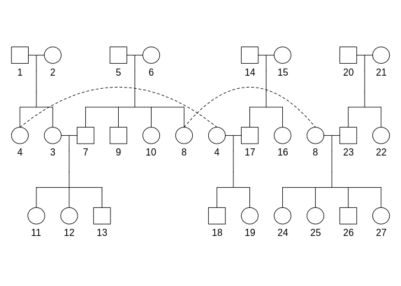
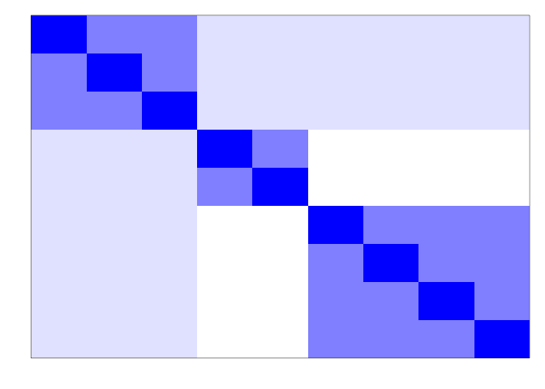
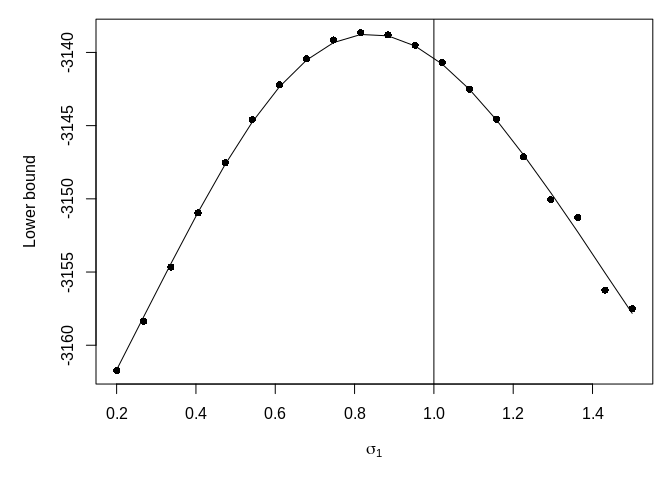

# survTMB

[](https://travis-ci.org/boennecd/survTMB)
<!-- [](https://www.r-pkg.org/badges/version/survTMB) -->
<!-- [](https://cran.r-project.org/package=survTMB) -->

This package contains methods to estimated mixed generalized survival
models (Liu, Pawitan, and Clements 2016, 2017). All methods use
automatic differentiation using the CppAD library (Bell 2019) through
[the TMB package](https://github.com/kaskr/adcomp) (Kristensen et al.
2016). The estimation methods are

  - a Laplace approximation using
    [TMB](https://github.com/kaskr/adcomp).
  - Gaussian variational approximation (GVA) similar to the method shown
    by Ormerod and Wand (2012).
  - Skew-normal variational approximation (SNVA) similar to the method
    shown by Ormerod (2011).

The [example](#example) section shows an example of how to use the
package with different methods. The [benchmark](#benchmark) section
shows a comparison of the computation time of the methods.

Joint marker and survival models are also available in the package. We
show an example of estimating a joint model in the [joint
models](#joint-models) section.

## Installation

The package can be installed from Github by calling:

``` r
library(remotes)
install_github("boennecd/psqn")    # we need the psqn package
install_github("boennecd/survTMB")
```

## Example

We estimate a GSM a below with the proportional odds (PO) link function
using both a Laplace approximation, a GVA, and a SNVA. First, we define
a function to perform the estimation.

``` r
# assign variable with data 
dat <- coxme::eortc

# assign function to estimate the model
library(survTMB)
library(survival)
fit_model <- function(link, n_threads = 2L, method = "Laplace", 
                      param_type = "DP", dense_hess = FALSE, 
                      sparse_hess = FALSE, do_fit = TRUE, 
                      do_free = FALSE)
  eval(bquote({
    adfun <- make_mgsm_ADFun(
      Surv(y, uncens) ~ trt, cluster = as.factor(center), 
      Z = ~ trt, df = 3L, data = dat, link = .(link), do_setup = .(method), 
      n_threads = .(n_threads), param_type = .(param_type), n_nodes = 15L, 
      dense_hess = .(dense_hess), sparse_hess = .(sparse_hess))
    fit <- if(.(do_fit))
      fit_mgsm(adfun, method = .(method)) else NULL
    if(.(do_free))
      free_laplace(adfun)
    list(fit = fit, fun = adfun)
  }), parent.frame())

# # estimate the model using different methods. Start w/ Laplace
(lap_ph <- fit_model("PO"))$fit
#> 
#> MGSM estimated with method 'Laplace' with link 'PO' from call:
#>   make_mgsm_ADFun(formula = Surv(y, uncens) ~ trt, data = dat, 
#>       df = 3L, Z = ~trt, cluster = as.factor(center), do_setup = "Laplace", 
#>       n_nodes = 15L, param_type = "DP", link = "PO", n_threads = 2L, 
#>       dense_hess = FALSE, sparse_hess = FALSE)
#>   fit_mgsm(object = adfun, method = "Laplace")
#> 
#> Estimated fixed effects:
#>                             (Intercept)                                     trt 
#>                                   -8.05                                    1.03 
#> nsx(log(y), df = 3, intercept = FALSE)1 nsx(log(y), df = 3, intercept = FALSE)2 
#>                                    5.70                                   11.82 
#> nsx(log(y), df = 3, intercept = FALSE)3 
#>                                    5.59 
#> 
#> Estimated random effect covariance matrix (correlation matrix) is:
#>             (Intercept)    trt       (Intercept)   trt
#> (Intercept)      0.0470 0.0554             0.217 0.734
#> trt              0.0554 0.1210             0.734 0.348
#> (standard deviations are in the diagonal of the correlation matrix)
#> 
#> Estimated log-likelihood is -13031.16

# w/ GVA
(gva_fit <- fit_model("PO", method = "GVA"))$fit
#> 
#> MGSM estimated with method 'GVA' with link 'PO' from call:
#>   make_mgsm_ADFun(formula = Surv(y, uncens) ~ trt, data = dat, 
#>       df = 3L, Z = ~trt, cluster = as.factor(center), do_setup = "GVA", 
#>       n_nodes = 15L, param_type = "DP", link = "PO", n_threads = 2L, 
#>       dense_hess = FALSE, sparse_hess = FALSE)
#>   fit_mgsm(object = adfun, method = "GVA")
#> 
#> Estimated fixed effects:
#>                             (Intercept)                                     trt 
#>                                   -8.05                                    1.03 
#> nsx(log(y), df = 3, intercept = FALSE)1 nsx(log(y), df = 3, intercept = FALSE)2 
#>                                    5.70                                   11.82 
#> nsx(log(y), df = 3, intercept = FALSE)3 
#>                                    5.59 
#> 
#> Estimated random effect covariance matrix (correlation matrix) is:
#>             (Intercept)    trt       (Intercept)   trt
#> (Intercept)      0.0446 0.0585             0.211 0.806
#> trt              0.0585 0.1181             0.806 0.344
#> (standard deviations are in the diagonal of the correlation matrix)
#> 
#> Estimated lower bound is -13031.10

# w/ SNVA
(snva_fit <- fit_model("PO", method = "SNVA", param_type = "DP"))$fit
#> 
#> MGSM estimated with method 'SNVA' with link 'PO' from call:
#>   make_mgsm_ADFun(formula = Surv(y, uncens) ~ trt, data = dat, 
#>       df = 3L, Z = ~trt, cluster = as.factor(center), do_setup = "SNVA", 
#>       n_nodes = 15L, param_type = "DP", link = "PO", n_threads = 2L, 
#>       dense_hess = FALSE, sparse_hess = FALSE)
#>   fit_mgsm(object = adfun, method = "SNVA")
#> 
#> Estimated fixed effects:
#>                             (Intercept)                                     trt 
#>                                   -8.05                                    1.03 
#> nsx(log(y), df = 3, intercept = FALSE)1 nsx(log(y), df = 3, intercept = FALSE)2 
#>                                    5.70                                   11.82 
#> nsx(log(y), df = 3, intercept = FALSE)3 
#>                                    5.59 
#> 
#> Estimated random effect covariance matrix (correlation matrix) is:
#>             (Intercept)    trt       (Intercept)   trt
#> (Intercept)      0.0446 0.0585             0.211 0.806
#> trt              0.0585 0.1182             0.806 0.344
#> (standard deviations are in the diagonal of the correlation matrix)
#> 
#> Estimated lower bound is -13031.10
```

### Computing the Hessian

The Hessian using a variational approximation (VA) can be computed as
both a dense matrix and as a sparse matrix. We show an example below
where we compare the two approaches.

``` r
library(microbenchmark) # needed for benchmarking
```

``` r
# fit model w/ GVA
fit <- fit_model("PO", method = "GVA", dense_hess = TRUE, 
                 sparse_hess = TRUE)

# compute dense Hessian
par <- with(fit$fit, c(params, va_params))
dense_hess <- fit$fun$gva$he(par)
num_hess <- numDeriv::jacobian(fit$fun$gva$gr, par)
all.equal(dense_hess, num_hess, tolerance = 1e-5)
#> [1] TRUE

# has many zeros (i.e. it is sparse)
mean(abs(dense_hess) > .Machine$double.eps) # fraction of non-zeros
#> [1] 0.103

# plot non-zero entries (black block's are non-zero; ignore upper triangle)
par(mar = c(1, 1, 1, 1))
is_non_zero <- t(abs(dense_hess) > .Machine$double.eps)
is_non_zero[upper.tri(is_non_zero)] <- FALSE
image(is_non_zero, xaxt = "n", yaxt = "n", 
      col = gray.colors(2, 1, 0))
```


``` r

# compute sparse Hessian
sparse_hess <- fit$fun$gva$he_sp(par)

# they are identical 
stopifnot(isTRUE(
  all.equal(as.matrix(sparse_hess), dense_hess, check.attributes = FALSE)))

# compare storage cost
as.numeric(object.size(dense_hess) / object.size(sparse_hess))
#> [1] 11

# we usually want the first part the inverse negative Hessian for the model 
# parameters. This can be computed as follows
library(Matrix)
n_vars <- length(fit$fit$params)
naiv_vcov <- function(hess)
  solve(hess)[1:n_vars, 1:n_vars]
alte_vcov <- function(hess){
  idx <- 1:n_vars
  A <- hess[ idx,  idx]
  C <- hess[-idx,  idx]
  D <- hess[-idx, -idx]
  solve(A - crossprod(C, solve(D, C)))
}

# these are the asymptotic standard deviations
structure(sqrt(diag(alte_vcov(dense_hess))), names = names(fit$fit$params))
#>                             (Intercept)                                     trt 
#>                                   0.420                                   0.109 
#> nsx(log(y), df = 3, intercept = FALSE)1 nsx(log(y), df = 3, intercept = FALSE)2 
#>                                   0.282                                   0.816 
#> nsx(log(y), df = 3, intercept = FALSE)3                              theta:L1.1 
#>                                   0.162                                   0.527 
#>                              theta:L2.1                              theta:L2.2 
#>                                   0.303                                   2.506

# check output is the same
stopifnot(
  isTRUE(all.equal(naiv_vcov(dense_hess), alte_vcov(dense_hess))),
  isTRUE(all.equal(naiv_vcov(dense_hess), as.matrix(alte_vcov(sparse_hess)), 
                   check.attributes = FALSE)),
  isTRUE(all.equal(naiv_vcov(dense_hess), as.matrix(naiv_vcov(sparse_hess)), 
                   check.attributes = FALSE)))

# compare computation time
microbenchmark(
  `Compute dense Hessian`               = fit$fun$gva$he(par), 
  `Compute sparse Hessian`              = fit$fun$gva$he_sp(par), 
  `Invert dense Hessian (naive)`        = naiv_vcov(dense_hess), 
  `Invert sparse Hessian (naive)`       = naiv_vcov(sparse_hess),
  `Invert dense Hessian (alternative)`  = alte_vcov(dense_hess), 
  `Invert sparse Hessian (alternative)` = alte_vcov(sparse_hess),
  times = 10)
#> Unit: microseconds
#>                                 expr    min     lq   mean median     uq    max
#>                Compute dense Hessian 322756 326220 326443 326681 327234 328511
#>               Compute sparse Hessian  19787  19850  20169  20090  20293  21225
#>         Invert dense Hessian (naive)   5270   5294   5372   5335   5416   5689
#>        Invert sparse Hessian (naive)    999   1022   1141   1116   1277   1353
#>   Invert dense Hessian (alternative)   1308   1342   1382   1349   1479   1493
#>  Invert sparse Hessian (alternative)   2743   2755   2996   2978   3184   3240
#>  neval
#>     10
#>     10
#>     10
#>     10
#>     10
#>     10
```

The sparse matrix only becomes more favorable for larger data sets (that
is, in terms of the number of clusters). However,
[recording](https://www.coin-or.org/CppAD/Doc/independent.htm) takes
some time and requires additional memory. We illustrate the additional
time below.

``` r
microbenchmark(
  `W/o Hessians     ` = fit_model("PO", method = "GVA", do_fit = FALSE), 
  `W/ dense Hessian ` = fit_model("PO", method = "GVA", do_fit = FALSE, 
                                  dense_hess = TRUE), 
  `W/ sparse Hessian` = fit_model("PO", method = "GVA", do_fit = FALSE, 
                                  sparse_hess = TRUE), 
  times = 10)
#> Unit: milliseconds
#>               expr   min    lq  mean median    uq max neval
#>  W/o Hessians       28.7  29.4  41.7   32.1  33.9 133    10
#>  W/ dense Hessian   79.9  80.8  85.0   82.0  85.6 100    10
#>  W/ sparse Hessian 668.9 673.3 685.8  681.5 699.1 707    10
```

### Approximation of the Conditional Distribution

The variational parameters provide an approximation of the conditional
distribution given the data and parameters or the posterior in a
Bayesian view. As an example, we can look at the multivariate normal
distribution approximation which is made by the GVA for the first group
below.

``` r
va_params <- gva_fit$fit$va_params
is_this_group <- which(grepl("^g1:", names(va_params)))
n_random_effects <- 2L

# conditional mean of random effects
va_params[is_this_group][seq_len(n_random_effects)]
#> g1:mu1 g1:mu2 
#>  0.367  0.614

# conditional covariance matrix of random effects
theta_to_cov(va_params[is_this_group][-seq_len(n_random_effects)])
#>         [,1]    [,2]
#> [1,] 0.01314 0.00623
#> [2,] 0.00623 0.02920
```

We can compare this with the multivariate skew-normal distribution
approximation from the SNVA.

``` r
va_params <- snva_fit$fit$va_params
is_this_group <- which(grepl("^g1:", names(va_params)))
n_random_effects <- 2L

xi <- va_params[is_this_group][seq_len(n_random_effects)]
Psi <- head(tail(va_params[is_this_group], -n_random_effects), 
            -n_random_effects)
Psi <- theta_to_cov(Psi)
alpha <- tail(va_params[is_this_group], n_random_effects)

# conditional mean, covariance matrix, and Pearson's moment coefficient of 
# skewness
dp_to_cp(xi = xi, Psi = Psi, alpha = alpha)
#> $mu
#> g1:mu1 g1:mu2 
#>  0.367  0.614 
#> 
#> $Sigma
#>         [,1]    [,2]
#> [1,] 0.01314 0.00622
#> [2,] 0.00622 0.02920
#> 
#> $gamma
#> [1] -1e-04 -1e-04
```

from the default values possibly because the lower bound is quite flat
in these parameters in this area.

``` r
skews <- sapply(1:37, function(id){
  va_params <- snva_fit$fit$va_params
  is_this_group <- which(grepl(paste0("^g", id, ":"), names(va_params)))
  
  xi <- va_params[is_this_group][seq_len(n_random_effects)]
  Psi <- head(tail(va_params[is_this_group], -n_random_effects), 
              -n_random_effects)
  Psi <- theta_to_cov(Psi)
  alpha <- tail(va_params[is_this_group], n_random_effects)
  dp_to_cp(xi = xi, Psi = Psi, alpha = alpha)$gamma
})

apply(skews, 1L, quantile, probs = seq(0, 1, by = .25))
#>           [,1]      [,2]
#> 0%   -1.00e-04 -1.00e-04
#> 25%  -1.00e-04 -1.00e-04
#> 50%  -1.00e-04 -1.00e-04
#> 75%  -1.00e-04 -1.00e-04
#> 100% -9.99e-05 -9.99e-05
```

Again, the skewness parameter have not moved much from the defaults.

### Other link functions

We estimate the same model below with other link functions.

``` r
######
# w/ Laplace
fit_model("PH"    , do_free = TRUE)$fit
#> 
#> MGSM estimated with method 'Laplace' with link 'PH' from call:
#>   make_mgsm_ADFun(formula = Surv(y, uncens) ~ trt, data = dat, 
#>       df = 3L, Z = ~trt, cluster = as.factor(center), do_setup = "Laplace", 
#>       n_nodes = 15L, param_type = "DP", link = "PH", n_threads = 2L, 
#>       dense_hess = FALSE, sparse_hess = FALSE)
#>   fit_mgsm(object = adfun, method = "Laplace")
#> 
#> Estimated fixed effects:
#>                             (Intercept)                                     trt 
#>                                  -7.822                                   0.719 
#> nsx(log(y), df = 3, intercept = FALSE)1 nsx(log(y), df = 3, intercept = FALSE)2 
#>                                   5.394                                  11.389 
#> nsx(log(y), df = 3, intercept = FALSE)3 
#>                                   4.799 
#> 
#> Estimated random effect covariance matrix (correlation matrix) is:
#>             (Intercept)    trt       (Intercept)  trt
#> (Intercept)      0.0238 0.0316             0.154 0.93
#> trt              0.0316 0.0484             0.930 0.22
#> (standard deviations are in the diagonal of the correlation matrix)
#> 
#> Estimated log-likelihood is -13026.67
fit_model("PO"    , do_free = TRUE)$fit
#> 
#> MGSM estimated with method 'Laplace' with link 'PO' from call:
#>   make_mgsm_ADFun(formula = Surv(y, uncens) ~ trt, data = dat, 
#>       df = 3L, Z = ~trt, cluster = as.factor(center), do_setup = "Laplace", 
#>       n_nodes = 15L, param_type = "DP", link = "PO", n_threads = 2L, 
#>       dense_hess = FALSE, sparse_hess = FALSE)
#>   fit_mgsm(object = adfun, method = "Laplace")
#> 
#> Estimated fixed effects:
#>                             (Intercept)                                     trt 
#>                                   -8.05                                    1.03 
#> nsx(log(y), df = 3, intercept = FALSE)1 nsx(log(y), df = 3, intercept = FALSE)2 
#>                                    5.70                                   11.82 
#> nsx(log(y), df = 3, intercept = FALSE)3 
#>                                    5.59 
#> 
#> Estimated random effect covariance matrix (correlation matrix) is:
#>             (Intercept)    trt       (Intercept)   trt
#> (Intercept)      0.0470 0.0554             0.217 0.734
#> trt              0.0554 0.1210             0.734 0.348
#> (standard deviations are in the diagonal of the correlation matrix)
#> 
#> Estimated log-likelihood is -13031.16
fit_model("probit", do_free = TRUE)$fit
#> 
#> MGSM estimated with method 'Laplace' with link 'probit' from call:
#>   make_mgsm_ADFun(formula = Surv(y, uncens) ~ trt, data = dat, 
#>       df = 3L, Z = ~trt, cluster = as.factor(center), do_setup = "Laplace", 
#>       n_nodes = 15L, param_type = "DP", link = "probit", n_threads = 2L, 
#>       dense_hess = FALSE, sparse_hess = FALSE)
#>   fit_mgsm(object = adfun, method = "Laplace")
#> 
#> Estimated fixed effects:
#>                             (Intercept)                                     trt 
#>                                  -3.740                                   0.599 
#> nsx(log(y), df = 3, intercept = FALSE)1 nsx(log(y), df = 3, intercept = FALSE)2 
#>                                   2.660                                   5.004 
#> nsx(log(y), df = 3, intercept = FALSE)3 
#>                                   2.972 
#> 
#> Estimated random effect covariance matrix (correlation matrix) is:
#>             (Intercept)    trt       (Intercept)   trt
#> (Intercept)      0.0184 0.0169             0.136 0.620
#> trt              0.0169 0.0403             0.620 0.201
#> (standard deviations are in the diagonal of the correlation matrix)
#> 
#> Estimated log-likelihood is -13035.14

######
# w/ GVA
fit_model("PH"    , method = "GVA")$fit
#> 
#> MGSM estimated with method 'GVA' with link 'PH' from call:
#>   make_mgsm_ADFun(formula = Surv(y, uncens) ~ trt, data = dat, 
#>       df = 3L, Z = ~trt, cluster = as.factor(center), do_setup = "GVA", 
#>       n_nodes = 15L, param_type = "DP", link = "PH", n_threads = 2L, 
#>       dense_hess = FALSE, sparse_hess = FALSE)
#>   fit_mgsm(object = adfun, method = "GVA")
#> 
#> Estimated fixed effects:
#>                             (Intercept)                                     trt 
#>                                  -7.827                                   0.724 
#> nsx(log(y), df = 3, intercept = FALSE)1 nsx(log(y), df = 3, intercept = FALSE)2 
#>                                   5.394                                  11.390 
#> nsx(log(y), df = 3, intercept = FALSE)3 
#>                                   4.800 
#> 
#> Estimated random effect covariance matrix (correlation matrix) is:
#>             (Intercept)    trt       (Intercept)   trt
#> (Intercept)      0.0292 0.0256             0.171 0.640
#> trt              0.0256 0.0550             0.640 0.234
#> (standard deviations are in the diagonal of the correlation matrix)
#> 
#> Estimated lower bound is -13026.74
fit_model("PO"    , method = "GVA")$fit
#> 
#> MGSM estimated with method 'GVA' with link 'PO' from call:
#>   make_mgsm_ADFun(formula = Surv(y, uncens) ~ trt, data = dat, 
#>       df = 3L, Z = ~trt, cluster = as.factor(center), do_setup = "GVA", 
#>       n_nodes = 15L, param_type = "DP", link = "PO", n_threads = 2L, 
#>       dense_hess = FALSE, sparse_hess = FALSE)
#>   fit_mgsm(object = adfun, method = "GVA")
#> 
#> Estimated fixed effects:
#>                             (Intercept)                                     trt 
#>                                   -8.05                                    1.03 
#> nsx(log(y), df = 3, intercept = FALSE)1 nsx(log(y), df = 3, intercept = FALSE)2 
#>                                    5.70                                   11.82 
#> nsx(log(y), df = 3, intercept = FALSE)3 
#>                                    5.59 
#> 
#> Estimated random effect covariance matrix (correlation matrix) is:
#>             (Intercept)    trt       (Intercept)   trt
#> (Intercept)      0.0446 0.0585             0.211 0.806
#> trt              0.0585 0.1181             0.806 0.344
#> (standard deviations are in the diagonal of the correlation matrix)
#> 
#> Estimated lower bound is -13031.10
fit_model("probit", method = "GVA")$fit
#> 
#> MGSM estimated with method 'GVA' with link 'probit' from call:
#>   make_mgsm_ADFun(formula = Surv(y, uncens) ~ trt, data = dat, 
#>       df = 3L, Z = ~trt, cluster = as.factor(center), do_setup = "GVA", 
#>       n_nodes = 15L, param_type = "DP", link = "probit", n_threads = 2L, 
#>       dense_hess = FALSE, sparse_hess = FALSE)
#>   fit_mgsm(object = adfun, method = "GVA")
#> 
#> Estimated fixed effects:
#>                             (Intercept)                                     trt 
#>                                  -3.742                                   0.602 
#> nsx(log(y), df = 3, intercept = FALSE)1 nsx(log(y), df = 3, intercept = FALSE)2 
#>                                   2.660                                   5.004 
#> nsx(log(y), df = 3, intercept = FALSE)3 
#>                                   2.972 
#> 
#> Estimated random effect covariance matrix (correlation matrix) is:
#>             (Intercept)    trt       (Intercept)   trt
#> (Intercept)      0.0195 0.0149             0.140 0.513
#> trt              0.0149 0.0434             0.513 0.208
#> (standard deviations are in the diagonal of the correlation matrix)
#> 
#> Estimated lower bound is -13035.14

######
# w/ SNVA (DP: direct parameterization)
fit_model("PH"    , method = "SNVA", param_type = "DP")$fit
#> 
#> MGSM estimated with method 'SNVA' with link 'PH' from call:
#>   make_mgsm_ADFun(formula = Surv(y, uncens) ~ trt, data = dat, 
#>       df = 3L, Z = ~trt, cluster = as.factor(center), do_setup = "SNVA", 
#>       n_nodes = 15L, param_type = "DP", link = "PH", n_threads = 2L, 
#>       dense_hess = FALSE, sparse_hess = FALSE)
#>   fit_mgsm(object = adfun, method = "SNVA")
#> 
#> Estimated fixed effects:
#>                             (Intercept)                                     trt 
#>                                  -7.827                                   0.724 
#> nsx(log(y), df = 3, intercept = FALSE)1 nsx(log(y), df = 3, intercept = FALSE)2 
#>                                   5.394                                  11.390 
#> nsx(log(y), df = 3, intercept = FALSE)3 
#>                                   4.800 
#> 
#> Estimated random effect covariance matrix (correlation matrix) is:
#>             (Intercept)    trt       (Intercept)   trt
#> (Intercept)      0.0292 0.0256             0.171 0.638
#> trt              0.0256 0.0548             0.638 0.234
#> (standard deviations are in the diagonal of the correlation matrix)
#> 
#> Estimated lower bound is -13026.74
fit_model("PO"    , method = "SNVA", param_type = "DP")$fit
#> 
#> MGSM estimated with method 'SNVA' with link 'PO' from call:
#>   make_mgsm_ADFun(formula = Surv(y, uncens) ~ trt, data = dat, 
#>       df = 3L, Z = ~trt, cluster = as.factor(center), do_setup = "SNVA", 
#>       n_nodes = 15L, param_type = "DP", link = "PO", n_threads = 2L, 
#>       dense_hess = FALSE, sparse_hess = FALSE)
#>   fit_mgsm(object = adfun, method = "SNVA")
#> 
#> Estimated fixed effects:
#>                             (Intercept)                                     trt 
#>                                   -8.05                                    1.03 
#> nsx(log(y), df = 3, intercept = FALSE)1 nsx(log(y), df = 3, intercept = FALSE)2 
#>                                    5.70                                   11.82 
#> nsx(log(y), df = 3, intercept = FALSE)3 
#>                                    5.59 
#> 
#> Estimated random effect covariance matrix (correlation matrix) is:
#>             (Intercept)    trt       (Intercept)   trt
#> (Intercept)      0.0446 0.0585             0.211 0.806
#> trt              0.0585 0.1182             0.806 0.344
#> (standard deviations are in the diagonal of the correlation matrix)
#> 
#> Estimated lower bound is -13031.10
fit_model("probit", method = "SNVA", param_type = "DP")$fit
#> 
#> MGSM estimated with method 'SNVA' with link 'probit' from call:
#>   make_mgsm_ADFun(formula = Surv(y, uncens) ~ trt, data = dat, 
#>       df = 3L, Z = ~trt, cluster = as.factor(center), do_setup = "SNVA", 
#>       n_nodes = 15L, param_type = "DP", link = "probit", n_threads = 2L, 
#>       dense_hess = FALSE, sparse_hess = FALSE)
#>   fit_mgsm(object = adfun, method = "SNVA")
#> 
#> Estimated fixed effects:
#>                             (Intercept)                                     trt 
#>                                  -3.742                                   0.602 
#> nsx(log(y), df = 3, intercept = FALSE)1 nsx(log(y), df = 3, intercept = FALSE)2 
#>                                   2.660                                   5.004 
#> nsx(log(y), df = 3, intercept = FALSE)3 
#>                                   2.973 
#> 
#> Estimated random effect covariance matrix (correlation matrix) is:
#>             (Intercept)    trt       (Intercept)   trt
#> (Intercept)      0.0195 0.0149             0.140 0.513
#> trt              0.0149 0.0434             0.513 0.208
#> (standard deviations are in the diagonal of the correlation matrix)
#> 
#> Estimated lower bound is -13035.14

######
# w/ SNVA (CP: centralized parameterization)
fit_model("PH"    , method = "SNVA", param_type = "CP_trans")$fit
#> 
#> MGSM estimated with method 'SNVA' with link 'PH' from call:
#>   make_mgsm_ADFun(formula = Surv(y, uncens) ~ trt, data = dat, 
#>       df = 3L, Z = ~trt, cluster = as.factor(center), do_setup = "SNVA", 
#>       n_nodes = 15L, param_type = "CP_trans", link = "PH", n_threads = 2L, 
#>       dense_hess = FALSE, sparse_hess = FALSE)
#>   fit_mgsm(object = adfun, method = "SNVA")
#> 
#> Estimated fixed effects:
#>                             (Intercept)                                     trt 
#>                                  -7.827                                   0.724 
#> nsx(log(y), df = 3, intercept = FALSE)1 nsx(log(y), df = 3, intercept = FALSE)2 
#>                                   5.394                                  11.390 
#> nsx(log(y), df = 3, intercept = FALSE)3 
#>                                   4.800 
#> 
#> Estimated random effect covariance matrix (correlation matrix) is:
#>             (Intercept)    trt       (Intercept)   trt
#> (Intercept)      0.0292 0.0256             0.171 0.638
#> trt              0.0256 0.0548             0.638 0.234
#> (standard deviations are in the diagonal of the correlation matrix)
#> 
#> Estimated lower bound is -13026.74
fit_model("PO"    , method = "SNVA", param_type = "CP_trans")$fit
#> 
#> MGSM estimated with method 'SNVA' with link 'PO' from call:
#>   make_mgsm_ADFun(formula = Surv(y, uncens) ~ trt, data = dat, 
#>       df = 3L, Z = ~trt, cluster = as.factor(center), do_setup = "SNVA", 
#>       n_nodes = 15L, param_type = "CP_trans", link = "PO", n_threads = 2L, 
#>       dense_hess = FALSE, sparse_hess = FALSE)
#>   fit_mgsm(object = adfun, method = "SNVA")
#> 
#> Estimated fixed effects:
#>                             (Intercept)                                     trt 
#>                                   -8.05                                    1.03 
#> nsx(log(y), df = 3, intercept = FALSE)1 nsx(log(y), df = 3, intercept = FALSE)2 
#>                                    5.70                                   11.82 
#> nsx(log(y), df = 3, intercept = FALSE)3 
#>                                    5.59 
#> 
#> Estimated random effect covariance matrix (correlation matrix) is:
#>             (Intercept)    trt       (Intercept)   trt
#> (Intercept)      0.0446 0.0585             0.211 0.806
#> trt              0.0585 0.1182             0.806 0.344
#> (standard deviations are in the diagonal of the correlation matrix)
#> 
#> Estimated lower bound is -13031.10
fit_model("probit", method = "SNVA", param_type = "CP_trans")$fit
#> 
#> MGSM estimated with method 'SNVA' with link 'probit' from call:
#>   make_mgsm_ADFun(formula = Surv(y, uncens) ~ trt, data = dat, 
#>       df = 3L, Z = ~trt, cluster = as.factor(center), do_setup = "SNVA", 
#>       n_nodes = 15L, param_type = "CP_trans", link = "probit", 
#>       n_threads = 2L, dense_hess = FALSE, sparse_hess = FALSE)
#>   fit_mgsm(object = adfun, method = "SNVA")
#> 
#> Estimated fixed effects:
#>                             (Intercept)                                     trt 
#>                                  -3.742                                   0.602 
#> nsx(log(y), df = 3, intercept = FALSE)1 nsx(log(y), df = 3, intercept = FALSE)2 
#>                                   2.660                                   5.004 
#> nsx(log(y), df = 3, intercept = FALSE)3 
#>                                   2.973 
#> 
#> Estimated random effect covariance matrix (correlation matrix) is:
#>             (Intercept)    trt       (Intercept)   trt
#> (Intercept)      0.0195 0.0149             0.140 0.513
#> trt              0.0149 0.0434             0.513 0.208
#> (standard deviations are in the diagonal of the correlation matrix)
#> 
#> Estimated lower bound is -13035.14
```

## Benchmark

We provide a benchmark of the estimation methods used in section
[example](#example) below.

``` r
for(mth in c("Laplace", "GVA")){
  msg <- sprintf("Method: %s", mth)
  cat(sprintf("\n%s\n%s\n", msg, 
              paste0(rep("-", nchar(msg)), collapse = "")))
  print(microbenchmark(
    `PH         ` = fit_model("PH"    , 1L, mth, do_free = TRUE),
    `PH     (2L)` = fit_model("PH"    , 2L, mth, do_free = TRUE),
    `PH     (4L)` = fit_model("PH"    , 4L, mth, do_free = TRUE),
    
    `PO         ` = fit_model("PO"    , 1L, mth, do_free = TRUE),
    `PO     (2L)` = fit_model("PO"    , 2L, mth, do_free = TRUE),
    `PO     (4L)` = fit_model("PO"    , 4L, mth, do_free = TRUE), 
    
    `probit     ` = fit_model("probit", 1L, mth, do_free = TRUE),
    `probit (2L)` = fit_model("probit", 2L, mth, do_free = TRUE),
    `probit (4L)` = fit_model("probit", 4L, mth, do_free = TRUE),
    times = 5))
}
#> 
#> Method: Laplace
#> ---------------
#> Unit: milliseconds
#>         expr  min   lq mean median   uq  max neval
#>  PH           912  917  922    921  922  938     5
#>  PH     (2L)  585  590  596    594  595  618     5
#>  PH     (4L)  438  439  461    442  452  535     5
#>  PO          1512 1521 1522   1523 1528 1528     5
#>  PO     (2L)  952  958  961    963  963  967     5
#>  PO     (4L)  688  702  708    706  710  735     5
#>  probit      2366 2374 2378   2376 2382 2391     5
#>  probit (2L)  982  993 1014    993 1049 1055     5
#>  probit (4L) 1104 1119 1132   1123 1154 1159     5
#> 
#> Method: GVA
#> -----------
#> Unit: milliseconds
#>         expr   min  lq mean median    uq   max neval
#>  PH          191.0 191  194    194 196.7 198.1     5
#>  PH     (2L) 120.2 120  122    122 123.1 123.7     5
#>  PH     (4L)  91.1  92   93     92  94.5  95.5     5
#>  PO          575.9 578  581    583 582.8 586.7     5
#>  PO     (2L) 340.9 345  347    346 351.6 351.9     5
#>  PO     (4L) 234.4 235  239    238 241.8 243.2     5
#>  probit      718.7 722  727    729 730.8 733.0     5
#>  probit (2L) 424.9 426  428    427 429.4 430.3     5
#>  probit (4L) 291.2 291  294    293 294.4 299.3     5
```

``` r
for(param_type in c("DP", "CP_trans")){
  mth <- "SNVA"
  msg <- sprintf("Method: %s (%s)", mth, param_type)
  cat(sprintf("\n%s\n%s\n", msg, 
              paste0(rep("-", nchar(msg)), collapse = "")))
  print(suppressWarnings(microbenchmark(
    `PH         ` = fit_model("PH"    , 1L, mth, param_type = param_type),
    `PH     (2L)` = fit_model("PH"    , 2L, mth, param_type = param_type),
    `PH     (4L)` = fit_model("PH"    , 4L, mth, param_type = param_type),
    
    `PO         ` = fit_model("PO"    , 1L, mth, param_type = param_type),
    `PO     (2L)` = fit_model("PO"    , 2L, mth, param_type = param_type),
    `PO     (4L)` = fit_model("PO"    , 4L, mth, param_type = param_type), 
    
    `probit     ` = fit_model("probit", 1L, mth, param_type = param_type),
    `probit (2L)` = fit_model("probit", 2L, mth, param_type = param_type),
    `probit (4L)` = fit_model("probit", 4L, mth, param_type = param_type),
    times = 5)))
}
#> 
#> Method: SNVA (DP)
#> -----------------
#> Unit: milliseconds
#>         expr min  lq mean median  uq max neval
#>  PH          221 223  224    224 226 226     5
#>  PH     (2L) 140 141  143    141 145 146     5
#>  PH     (4L) 108 109  128    109 114 200     5
#>  PO          748 751  752    751 752 756     5
#>  PO     (2L) 438 442  445    446 448 452     5
#>  PO     (4L) 304 304  324    307 310 396     5
#>  probit      921 927  928    928 930 932     5
#>  probit (2L) 536 538  541    540 543 546     5
#>  probit (4L) 362 372  371    372 373 376     5
#> 
#> Method: SNVA (CP_trans)
#> -----------------------
#> Unit: milliseconds
#>         expr min  lq mean median  uq max neval
#>  PH          288 288  290    290 293 294     5
#>  PH     (2L) 178 178  180    181 181 184     5
#>  PH     (4L) 134 135  138    137 140 144     5
#>  PO          739 740  742    741 744 745     5
#>  PO     (2L) 438 439  443    441 443 453     5
#>  PO     (4L) 299 299  303    303 303 312     5
#>  probit      920 921  922    922 922 925     5
#>  probit (2L) 535 536  537    537 540 540     5
#>  probit (4L) 365 365  368    367 368 375     5
```

### Using the psqn Interface

Another option is to use [the psqn
package](https://github.com/boennecd/psqn) through this package. This
can be done as
follows:

``` r
# get the object needed to perform the estimation both for a SNVA and for 
# a GVA
psqn_obj_snva <- make_mgsm_psqn_obj(
  formula = Surv(y, uncens) ~ trt, data = dat, 
  df = 3L, Z = ~trt, cluster = as.factor(center), method = "SNVA", 
  n_nodes = 15L, link = "PO", n_threads = 2L)
psqn_obj_gva  <- make_mgsm_psqn_obj(
  formula = Surv(y, uncens) ~ trt, data = dat, 
  df = 3L, Z = ~trt, cluster = as.factor(center), method = "GVA", 
  n_nodes = 15L, link = "PO", n_threads = 2L)

# perform the estimation using either approximation
psqn_opt_snva <- optim_mgsm_psqn(psqn_obj_snva)
psqn_opt_gva  <- optim_mgsm_psqn(psqn_obj_gva)

# check that the function value is the same
all.equal(psqn_opt_snva$value, snva_fit$fit$optim$value)
#> [1] "Mean relative difference: 1.1e-06"
all.equal(psqn_opt_gva $value, gva_fit $fit$optim$value)
#> [1] "Mean relative difference: 1.1e-06"
```

It is not very attractive to use the optimization method from the psqn
package in this case as shown below.

``` r
microbenchmark(
  `Using psqn (SNVA)` = { 
    psqn_obj <- make_mgsm_psqn_obj(
      formula = Surv(y, uncens) ~ trt, data = dat, 
      df = 3L, Z = ~trt, cluster = as.factor(center), method = "SNVA", 
      n_nodes = 15L, link = "PO", n_threads = 2L)
    optim_mgsm_psqn(psqn_obj)
  },
  `Using psqn (GVA) ` = { 
    psqn_obj <- make_mgsm_psqn_obj(
      formula = Surv(y, uncens) ~ trt, data = dat, 
      df = 3L, Z = ~trt, cluster = as.factor(center), method = "GVA", 
      n_nodes = 15L, link = "PO", n_threads = 2L)
    optim_mgsm_psqn(psqn_obj)
  }, times = 5)
#> Unit: milliseconds
#>               expr min  lq mean median  uq max neval
#>  Using psqn (SNVA) 262 265  266    265 268 271     5
#>  Using psqn (GVA)  177 177  178    177 178 181     5
```

However, the optimization method from the psqn package may be more
useful when there are more clusters.

## Joint Models

We will use one of the test data sets in the
[inst/test-data](inst/test-data) directory. The data is generated with
the [inst/test-data/gen-test-data.R](inst/test-data/gen-test-data.R)
file which is available on Github. The file uses the
[SimSurvNMarker](https://github.com/boennecd/SimSurvNMarker) package to
simulate a data set. The model is simulated
from

<!-- $$\begin{align*} -->

<!-- \vec Y_{ij} \mid \vec U_i = \vec u_i -->

<!--   &\sim N^{(r)}(\vec \mu_i(s_{ij}, \vec u_i), \Sigma) -->

<!--   \\ -->

<!-- \vec\mu(s, \vec u) &= -->

<!--   \Gamma^\top \vec x_i + B^\top\vec g(s) + U^\top\vec m(s) -->

<!--   \\ -->

<!-- &= \left(I \otimes \vec x_i^\top\right)\text{vec}\Gamma -->

<!--      + \left(I \otimes \vec g(s)^\top\right)\text{vec} B -->

<!--      + \left(I \otimes \vec m(s)^\top\right) \vec u -->

<!--   \\ -->

<!-- \vec U_i &\sim N^{(K)}(\vec 0, \Psi) -->

<!--   \\ -->

<!-- h(t\mid \vec u) &= \exp\left( -->

<!--   \vec\omega^\top\vec b(t) + -->

<!--   \vec z_i^\top\vec\delta + -->

<!--   \vec\alpha^\top\vec\mu(t, \vec u) -->

<!--   \right) -->

<!--   \\ -->

<!-- &= \exp\Bigg( -->

<!--   \vec\omega^\top\vec b(t) + -->

<!--   \vec z_i^\top\vec\delta -->

<!--   + \vec 1^\top\left( -->

<!--   \text{diag}(\vec \alpha) \otimes \vec x_i^\top\right)\text{vec}\Gamma -->

<!--   + \vec 1^\top\left( -->

<!--   \text{diag}(\vec \alpha) \otimes \vec g(t)^\top\right)\text{vec} B \\ -->

<!-- &\hspace{50pt}+ \vec 1^\top\left( -->

<!--   \text{diag}(\vec \alpha) \otimes \vec m(t)^\top\right)\vec u -->

<!--   \Bigg) -->

<!-- \end{align*}$$ -->

  
![\\begin{align\*} \\vec Y\_{ij} \\mid \\vec U\_i = \\vec u\_i &\\sim
N^{(r)}(\\vec \\mu\_i(s\_{ij}, \\vec u\_i), \\Sigma) \\\\ \\vec\\mu(s,
\\vec u) &= \\Gamma^\\top \\vec x\_i + B^\\top\\vec g(s) + U^\\top\\vec
m(s) \\\\ &= \\left(I \\otimes \\vec
x\_i^\\top\\right)\\text{vec}\\Gamma + \\left(I \\otimes \\vec
g(s)^\\top\\right)\\text{vec} B + \\left(I \\otimes \\vec
m(s)^\\top\\right) \\vec u \\\\ \\vec U\_i &\\sim N^{(K)}(\\vec 0,
\\Psi) \\\\ h(t\\mid \\vec u) &= \\exp\\left( \\vec\\omega^\\top\\vec
b(t) + \\vec z\_i^\\top\\vec\\delta + \\vec\\alpha^\\top\\vec\\mu(t,
\\vec u) \\right) \\\\ &= \\exp\\Bigg( \\vec\\omega^\\top\\vec b(t) +
\\vec z\_i^\\top\\vec\\delta + \\vec 1^\\top\\left( \\text{diag}(\\vec
\\alpha) \\otimes \\vec x\_i^\\top\\right)\\text{vec}\\Gamma +
\\vec 1^\\top\\left( \\text{diag}(\\vec \\alpha) \\otimes \\vec
g(t)^\\top\\right)\\text{vec} B \\\\ &\\hspace{50pt}+
\\vec 1^\\top\\left( \\text{diag}(\\vec \\alpha) \\otimes \\vec
m(t)^\\top\\right)\\vec u \\Bigg)
\\end{align\*}](https://latex.codecogs.com/svg.latex?%5Cbegin%7Balign%2A%7D%20%20%5Cvec%20Y_%7Bij%7D%20%5Cmid%20%5Cvec%20U_i%20%3D%20%5Cvec%20u_i%20%20%20%20%26%5Csim%20N%5E%7B%28r%29%7D%28%5Cvec%20%5Cmu_i%28s_%7Bij%7D%2C%20%5Cvec%20u_i%29%2C%20%5CSigma%29%20%20%20%20%5C%5C%20%20%5Cvec%5Cmu%28s%2C%20%5Cvec%20u%29%20%26%3D%20%20%20%20%5CGamma%5E%5Ctop%20%5Cvec%20x_i%20%2B%20B%5E%5Ctop%5Cvec%20g%28s%29%20%2B%20U%5E%5Ctop%5Cvec%20m%28s%29%20%20%20%20%5C%5C%20%20%26%3D%20%5Cleft%28I%20%5Cotimes%20%5Cvec%20x_i%5E%5Ctop%5Cright%29%5Ctext%7Bvec%7D%5CGamma%20%20%20%20%20%20%20%2B%20%5Cleft%28I%20%5Cotimes%20%5Cvec%20g%28s%29%5E%5Ctop%5Cright%29%5Ctext%7Bvec%7D%20B%20%20%20%20%20%20%20%2B%20%5Cleft%28I%20%5Cotimes%20%5Cvec%20m%28s%29%5E%5Ctop%5Cright%29%20%5Cvec%20u%20%20%20%20%5C%5C%20%20%5Cvec%20U_i%20%26%5Csim%20N%5E%7B%28K%29%7D%28%5Cvec%200%2C%20%5CPsi%29%20%20%20%20%5C%5C%20%20h%28t%5Cmid%20%5Cvec%20u%29%20%26%3D%20%5Cexp%5Cleft%28%20%20%20%20%5Cvec%5Comega%5E%5Ctop%5Cvec%20b%28t%29%20%2B%20%20%20%20%5Cvec%20z_i%5E%5Ctop%5Cvec%5Cdelta%20%2B%20%20%20%20%5Cvec%5Calpha%5E%5Ctop%5Cvec%5Cmu%28t%2C%20%5Cvec%20u%29%20%20%20%20%5Cright%29%20%20%20%20%5C%5C%20%20%26%3D%20%5Cexp%5CBigg%28%20%20%20%20%5Cvec%5Comega%5E%5Ctop%5Cvec%20b%28t%29%20%2B%20%20%20%20%5Cvec%20z_i%5E%5Ctop%5Cvec%5Cdelta%20%20%20%20%2B%20%5Cvec%201%5E%5Ctop%5Cleft%28%20%20%20%20%5Ctext%7Bdiag%7D%28%5Cvec%20%5Calpha%29%20%5Cotimes%20%5Cvec%20x_i%5E%5Ctop%5Cright%29%5Ctext%7Bvec%7D%5CGamma%20%20%20%20%2B%20%5Cvec%201%5E%5Ctop%5Cleft%28%20%20%20%20%5Ctext%7Bdiag%7D%28%5Cvec%20%5Calpha%29%20%5Cotimes%20%5Cvec%20g%28t%29%5E%5Ctop%5Cright%29%5Ctext%7Bvec%7D%20B%20%5C%5C%20%20%26%5Chspace%7B50pt%7D%2B%20%5Cvec%201%5E%5Ctop%5Cleft%28%20%20%20%20%5Ctext%7Bdiag%7D%28%5Cvec%20%5Calpha%29%20%5Cotimes%20%5Cvec%20m%28t%29%5E%5Ctop%5Cright%29%5Cvec%20u%20%20%20%20%5CBigg%29%20%20%5Cend%7Balign%2A%7D
"\\begin{align*}  \\vec Y_{ij} \\mid \\vec U_i = \\vec u_i    &\\sim N^{(r)}(\\vec \\mu_i(s_{ij}, \\vec u_i), \\Sigma)    \\\\  \\vec\\mu(s, \\vec u) &=    \\Gamma^\\top \\vec x_i + B^\\top\\vec g(s) + U^\\top\\vec m(s)    \\\\  &= \\left(I \\otimes \\vec x_i^\\top\\right)\\text{vec}\\Gamma       + \\left(I \\otimes \\vec g(s)^\\top\\right)\\text{vec} B       + \\left(I \\otimes \\vec m(s)^\\top\\right) \\vec u    \\\\  \\vec U_i &\\sim N^{(K)}(\\vec 0, \\Psi)    \\\\  h(t\\mid \\vec u) &= \\exp\\left(    \\vec\\omega^\\top\\vec b(t) +    \\vec z_i^\\top\\vec\\delta +    \\vec\\alpha^\\top\\vec\\mu(t, \\vec u)    \\right)    \\\\  &= \\exp\\Bigg(    \\vec\\omega^\\top\\vec b(t) +    \\vec z_i^\\top\\vec\\delta    + \\vec 1^\\top\\left(    \\text{diag}(\\vec \\alpha) \\otimes \\vec x_i^\\top\\right)\\text{vec}\\Gamma    + \\vec 1^\\top\\left(    \\text{diag}(\\vec \\alpha) \\otimes \\vec g(t)^\\top\\right)\\text{vec} B \\\\  &\\hspace{50pt}+ \\vec 1^\\top\\left(    \\text{diag}(\\vec \\alpha) \\otimes \\vec m(t)^\\top\\right)\\vec u    \\Bigg)  \\end{align*}")  

where  is individual
’s
th observed marker at
time ,  is individual
’s random effect, and
 is the instantaneous
hazard rate for the time-to-event outcome.
 is the so-called association parameter. It shows the
strength of the relation between the latent mean function,
"), and the log of the instantaneous rate,
"). "), ") and ") are basis expansions of time. As an example, these can be
a polynomial, a B-spline, or a natural cubic spline. The expansion for
the baseline hazard, "), is typically made on  instead of
. One reason is that the
model reduces to a Weibull distribution when a first polynomial is used
and .  and
 are individual specific known covariates.

We start by loading the simulated data set.

``` r
dat <- readRDS(file.path("inst", "test-data", "large-joint-all.RDS"))

# the marker data
m_data <- dat$marker_data
head(m_data, 10)
#>    obs_time      Y1      Y2 X1 id
#> 1     2.358 -0.0313 -1.4347  1  1
#> 2     1.941 -1.6829  0.0705  0  2
#> 3     2.469 -1.1793 -0.2994  0  2
#> 4     0.679  0.5640 -0.4988  0  3
#> 5     0.633 -1.0614  0.1318  0  4
#> 6     0.704 -0.9367 -0.4324  0  4
#> 7     0.740 -0.6472  0.0842  0  4
#> 8     0.989 -1.0603  0.4740  0  4
#> 9     1.291 -0.5059  0.4103  0  4
#> 10    2.404 -0.6974  0.2074  0  4

# the survival data
s_data <- dat$survival_data
head(s_data, 10)
#>    Z1 Z2 left_trunc     y event id
#> 1   0  1      2.198 2.905  TRUE  1
#> 2   0  0      0.107 3.350  TRUE  2
#> 3   0  1      0.593 0.797  TRUE  3
#> 4   1  1      0.279 2.507  TRUE  4
#> 5   0  0      2.062 4.669  TRUE  5
#> 6   1  1      2.215 8.058 FALSE  6
#> 7   1  0      1.061 9.123 FALSE  7
#> 8   1  1      0.214 8.894 FALSE  8
#> 9   1  1      1.106 7.498 FALSE  9
#> 10  1  0      1.237 1.734  TRUE 10
```

There is

``` r
length(unique(s_data$id))
#> [1] 1000
length(unique(s_data$id)) == NROW(s_data) # one row per id
#> [1] TRUE
```

individuals who each has an average of

``` r
NROW(m_data) / length(unique(s_data$id))
#> [1] 3.74
```

observed markers. The data is simulated. Thus, we know the true
parameters. These are

``` r
dat$params[c("gamma", "B", "Psi", "omega", "delta", "alpha", "sigma")]
#> $gamma
#>      [,1] [,2]
#> [1,] 0.14 -0.8
#> 
#> $B
#>       [,1]  [,2]
#> [1,] -0.96  0.26
#> [2,]  0.33 -0.76
#> [3,]  0.39  0.19
#> 
#> $Psi
#>       [,1]  [,2]  [,3]  [,4]
#> [1,]  1.57 -0.37 -0.08 -0.17
#> [2,] -0.37  0.98 -0.05  0.09
#> [3,] -0.08 -0.05  0.87  0.53
#> [4,] -0.17  0.09  0.53  1.17
#> 
#> $omega
#> [1] -2.60 -1.32
#> 
#> $delta
#> [1]  0.20 -0.17
#> 
#> $alpha
#> [1]  0.32 -0.31
#> 
#> $sigma
#>      [,1] [,2]
#> [1,] 0.03 0.00
#> [2,] 0.00 0.05
```

We start by constructing the objective function in order to estimate the
model.

``` r
system.time(
  out <- make_joint_ADFun(
    sformula =  Surv(left_trunc, y, event) ~ Z1 + Z2, 
    mformula = cbind(Y1, Y2) ~ X1, 
    id_var = id, time_var = obs_time, 
    sdata = s_data, mdata = m_data, m_coefs = dat$params$m_attr$knots,
    s_coefs = dat$params$b_attr$knots, g_coefs = dat$params$g_attr$knots, 
    n_nodes = 30L, n_threads = 6L))
#>    user  system elapsed 
#>  29.524   0.016   7.259
```

Next, we fit the model using the default optimization function.

``` r
library(lbfgs)
system.time(
  opt_out <- lbfgs(out$fn, out$gr, out$par, max_iterations = 25000L, 
                   past = 100L, delta = sqrt(.Machine$double.eps), 
                   invisible = 1))
#>    user  system elapsed 
#>   166.7     0.0    27.8
```

The estimated lower bound of the log marginal likelihood at the optimum
is shown
below.

<!-- with(environment(out$fn), c(mark$ll, sr_dat$ll, mark$ll + sr_dat$ll)) -->

``` r
-opt_out$value
#> [1] -4124
```

Further, we can compare the estimated model parameters with the true
model parameters as follows.

``` r
names(opt_out$par) <- names(out$par)
true_params <- with(dat$params, c(
  gamma, B, cov_to_theta(Psi), cov_to_theta(sigma),
  delta, omega, alpha))
n_params <- length(true_params)
names(true_params) <- names(out$par)[seq_along(true_params)]
rbind(Estimate = opt_out$par[1:n_params], 
      `True value` = true_params)
#>            gamma:X1.Y1 gamma:X1.Y2 B:g1.Y1 B:g2.Y1 B:g3.Y1 B:g1.Y2 B:g2.Y2
#> Estimate         0.133      -0.802  -0.941    0.37   0.404   0.253  -0.848
#> True value       0.140      -0.800  -0.960    0.33   0.390   0.260  -0.760
#>            B:g3.Y2 Psi:L1.1 Psi:L2.1 Psi:L3.1 Psi:L4.1 Psi:L2.2 Psi:L3.2
#> Estimate    0.0623    0.238   -0.298  -0.1180   -0.229  -0.0370  -0.1161
#> True value  0.1900    0.226   -0.295  -0.0638   -0.136  -0.0567  -0.0729
#>            Psi:L4.2 Psi:L3.3 Psi:L4.3 Psi:L4.4 Sigma:L1.1 Sigma:L2.1 Sigma:L2.2
#> Estimate    -0.0235  -0.1274    0.546  -0.0904      -1.76    0.00305      -1.53
#> True value   0.0528  -0.0751    0.566  -0.0942      -1.75    0.00000      -1.50
#>            delta:Z1 delta:Z2 omega:b1 omega:b2 alpha:Y1 alpha:Y2
#> Estimate      0.238   -0.219    -2.51    -1.25    0.338   -0.276
#> True value    0.200   -0.170    -2.60    -1.32    0.320   -0.310
```

Next, we compare the estimated covariance matrix of the random effects
with the true
values.

``` r
# random effect covariance matrix (first estimated and then the true values)
is_psi <- which(grepl("Psi", names(true_params)))
theta_to_cov(opt_out$par[is_psi]) 
#>        [,1]    [,2]    [,3]    [,4]
#> [1,]  1.609 -0.3785 -0.1497 -0.2903
#> [2,] -0.379  1.0178 -0.0767  0.0457
#> [3,] -0.150 -0.0767  0.8025  0.5108
#> [4,] -0.290  0.0457  0.5108  1.1861
dat$params$Psi
#>       [,1]  [,2]  [,3]  [,4]
#> [1,]  1.57 -0.37 -0.08 -0.17
#> [2,] -0.37  0.98 -0.05  0.09
#> [3,] -0.08 -0.05  0.87  0.53
#> [4,] -0.17  0.09  0.53  1.17
cov2cor(theta_to_cov(opt_out$par[is_psi]))
#>        [,1]    [,2]    [,3]    [,4]
#> [1,]  1.000 -0.2958 -0.1317 -0.2101
#> [2,] -0.296  1.0000 -0.0848  0.0416
#> [3,] -0.132 -0.0848  1.0000  0.5236
#> [4,] -0.210  0.0416  0.5236  1.0000
cov2cor(dat$params$Psi)
#>         [,1]    [,2]    [,3]   [,4]
#> [1,]  1.0000 -0.2983 -0.0685 -0.125
#> [2,] -0.2983  1.0000 -0.0541  0.084
#> [3,] -0.0685 -0.0541  1.0000  0.525
#> [4,] -0.1254  0.0840  0.5253  1.000
```

Further, we compare the estimated covariance matrix of the noise with
the true values.

``` r
# noise covariance matrix (first estimated and then the true values)
is_sigma <- which(grepl("Sigma", names(true_params)))
theta_to_cov(opt_out$par[is_sigma])
#>          [,1]     [,2]
#> [1,] 0.029378 0.000522
#> [2,] 0.000522 0.047151
dat$params$sigma
#>      [,1] [,2]
#> [1,] 0.03 0.00
#> [2,] 0.00 0.05
cov2cor(theta_to_cov(opt_out$par[is_sigma]))
#>       [,1]  [,2]
#> [1,] 1.000 0.014
#> [2,] 0.014 1.000
cov2cor(dat$params$sigma)
#>      [,1] [,2]
#> [1,]    1    0
#> [2,]    0    1
```

We can look at quantiles of mean, standard deviations, and Pearson’s
moment coefficient of skewness for each individuals estimated
variational distribution as follows.

``` r
va_stats <- lapply(1:1000, function(id){
  is_grp_x <- which(grepl(paste0("^g", id, ":"), names(opt_out$par)))
  x_va_pars <- opt_out$par[is_grp_x]
  xi <- x_va_pars[grepl(":xi", names(x_va_pars))]
  Lambda <- theta_to_cov(
    x_va_pars[grepl(":(log_sd|L)", names(x_va_pars))])
  alpha <- x_va_pars[grepl(":alpha", names(x_va_pars))]
  
  dp_to_cp(xi = xi, Psi = Lambda, alpha = alpha)
})

sum_func <- function(x)
  apply(x, 2L, quantile, probs = seq(0, 1, by = .1))

# mean 
sum_func(do.call(rbind, lapply(va_stats, `[[`, "mu")))
#>       g1:xi1  g1:xi2  g1:xi3  g1:xi4
#> 0%   -3.4764 -3.6411 -2.3680 -2.7734
#> 10%  -1.4589 -0.9492 -0.8209 -0.9567
#> 20%  -1.0029 -0.6333 -0.4897 -0.5622
#> 30%  -0.6412 -0.3940 -0.2887 -0.3403
#> 40%  -0.3155 -0.1928 -0.1421 -0.1615
#> 50%  -0.0283 -0.0134 -0.0043 -0.0133
#> 60%   0.2932  0.1935  0.1246  0.1377
#> 70%   0.5998  0.3900  0.2755  0.3078
#> 80%   0.9928  0.5970  0.4698  0.5532
#> 90%   1.5259  1.0167  0.8506  0.9636
#> 100%  3.9393  2.9902  2.3182  2.6445

# standard deviation
sum_func(do.call(rbind, lapply(va_stats, 
                               function(x) sqrt(diag(x[["Sigma"]])))))
#>        [,1]  [,2]  [,3]  [,4]
#> 0%   0.0852 0.107 0.107 0.135
#> 10%  0.1287 0.236 0.160 0.295
#> 20%  0.1646 0.336 0.204 0.416
#> 30%  0.2268 0.463 0.280 0.568
#> 40%  0.3357 0.623 0.429 0.789
#> 50%  0.4583 0.665 0.602 0.852
#> 60%  0.5425 0.686 0.708 0.894
#> 70%  0.6036 0.710 0.778 0.930
#> 80%  0.6489 0.739 0.821 0.978
#> 90%  0.6877 0.781 0.848 1.024
#> 100% 0.7310 1.002 0.872 1.069

# skewness
skews <-  sum_func(do.call(rbind, lapply(va_stats, `[[`, "gamma")))
skews[] <- sprintf("%8.4f", skews)
print(skews, quote = FALSE)
#>      [,1]     [,2]     [,3]     [,4]    
#> 0%    -0.0053  -0.0053  -0.0031  -0.0031
#> 10%   -0.0008  -0.0008  -0.0001  -0.0001
#> 20%   -0.0006  -0.0006  -0.0001  -0.0001
#> 30%   -0.0006  -0.0006  -0.0001  -0.0001
#> 40%   -0.0006  -0.0005  -0.0001  -0.0001
#> 50%   -0.0005  -0.0005  -0.0000  -0.0000
#> 60%   -0.0005  -0.0004  -0.0000  -0.0000
#> 70%   -0.0004  -0.0004  -0.0000  -0.0000
#> 80%   -0.0003  -0.0002  -0.0000  -0.0000
#> 90%   -0.0001  -0.0001  -0.0000   0.0000
#> 100%   0.0000   0.0001   0.0003   0.0004
```

We only see a low amount of
skewness.

## Pedigree Data

<!-- $$\begin{align*}  -->

<!-- g(S(t\mid \vec x_{ij}, \epsilon_{ij})) &=  -->

<!--   \vec\omega^\top\vec f(t) + \vec\beta^\top\vec x_{ij} +\epsilon_{ij} \\ -->

<!-- \vec\epsilon_i &= (\epsilon_{i1}, \dots, \epsilon_{in_i})^\top \sim  -->

<!--   N^{(n_i)}\left(\vec 0, \sum_{l = 1}^K\sigma_l^2 C_{il} -->

<!--   \right) -->

<!-- \end{align*}$$ -->

The package contains an implementation of models which can be used to
estimate heritability using pedigree data. These are mixed GSMs of the
following form

  
) &=   \\vec\\omega^\\top\\vec f(t) + \\vec\\beta^\\top\\vec x_{ij} +\\epsilon_{ij} \\\\\\vec\\epsilon_i &= (\\epsilon_{i1}, \\dots, \\epsilon_{in_i})^\\top \\sim   N^{(n_i)}\\left(\\vec 0, \\sum_{l = 1}^K\\sigma_l^2 C_{il}  \\right)\\end{align*}")  

where  is a given link
function,  is a given function, the
s are individual specific random effects, and the


matrices are known. Various types of

matrices can be used. A typical example is to use a kinship matrix to
estimate genetic effects. Other examples are to include maternal
effects, paternal effects, shared environment etc.

As an example, we will use the `pedigree.RDS` in the
[inst/test-data](inst/test-data) directory.

<!-- knitr::opts_knit$set(output.dir = ".") -->

<!-- knitr::load_cache("README-pedigree_example", path = "cache/") -->

``` r
# load the data
library(survTMB)
dat <- readRDS(file.path("inst", "test-data", "pedigree.RDS"))
  
# prepare the cluster data
c_data <- lapply(dat$sim_data, function(x){
  data <- data.frame(Z = x$Z, y = x$y, event = x$event)
  cor_mats <- list(x$rel_mat)
  list(data = data, cor_mats = cor_mats)
})

# the data structue is as in Mahjani et al. (2020). As an example, the full 
# family for the first family is shown here
library(kinship2)
plot(dat$sim_data[[1L]]$pedAll)
```



``` r
# we only have the "last row" (youngest generation). There are is a gemetic
# effect like in Mahjani et al. (2020). See table S17 in supplemental 
# information. 
par(mar = c(2, 2, 1, 1))
cl <- colorRampPalette(c("Red", "White", "Blue"))(101)
rev_img <- function(x, ...)
  image(x[, NROW(x):1], ...)
rev_img(dat$sim_data[[1L]]$rel_mat, xaxt = "n", yaxt = "n", col = cl, 
        zlim = c(-1, 1))
```



``` r
library(Matrix)
as(dat$sim_data[[1L]]$rel_mat, "sparseMatrix")
#> 9 x 9 sparse Matrix of class "dgCMatrix"
#>       11    12    13    18    19    24    25    26    27
#> 11 1.000 0.500 0.500 0.125 0.125 0.125 0.125 0.125 0.125
#> 12 0.500 1.000 0.500 0.125 0.125 0.125 0.125 0.125 0.125
#> 13 0.500 0.500 1.000 0.125 0.125 0.125 0.125 0.125 0.125
#> 18 0.125 0.125 0.125 1.000 0.500 .     .     .     .    
#> 19 0.125 0.125 0.125 0.500 1.000 .     .     .     .    
#> 24 0.125 0.125 0.125 .     .     1.000 0.500 0.500 0.500
#> 25 0.125 0.125 0.125 .     .     0.500 1.000 0.500 0.500
#> 26 0.125 0.125 0.125 .     .     0.500 0.500 1.000 0.500
#> 27 0.125 0.125 0.125 .     .     0.500 0.500 0.500 1.000

#####
# some summary stats are
length(c_data)    # number of clusters (families)
#> [1] 1000

# number of obs / cluster
obs_in_cl <- sapply(c_data, function(x) NCOL(x$cor_mats[[1L]])) 
table(obs_in_cl) # distribution of cluster sizes
#> obs_in_cl
#>   3   4   5   6   7   8   9  10  11 
#>  28  49 115 231 248 192  98  34   5

# total number of observations
sum(obs_in_cl)
#> [1] 6790

# number of observed events
sum(sapply(c_data, function(x) sum(x$data$event)))
#> [1] 693

# use a third order polynomial as in the true model
sbase_haz <- function(x){
  x <- log(x)
  cbind(cubed = x^3, squared = x^2, x = x)
}
dsbase_haz <- function(x){
  y <- log(x)
  cbind(3 * y^2, 2 * y, 1) / x
}

# create ADFun
system.time(
  func <- make_pedigree_ADFun(
    formula = Surv(y, event) ~ Z.1 + Z.2 - 1, skew_start = -.001,
    tformula  = ~  sbase_haz(y) - 1, trace = TRUE, n_nodes = 15L,
    dtformula = ~ dsbase_haz(y) - 1, method = "SNVA",
    c_data = c_data, link = "probit", n_threads = 6L, 
    args_gva_opt = list(max_cg = 100L, c2 = .01)))
#> Finding starting values for the fixed effects...
#> Maximum log-likelihood without random effects is: -3166.694
#> Creating ADFun for the GVA...
#> Finding starting values for the variational parameters in the GVA...
#> The lower bound at the starting values with the GVA is: -3170.881
#> Optimizing the GVA to get starting values...
#> Maximum lower bound with the GVA is -3139.17...
#> Creating ADFun for the SNVA...
#> Finding starting values for the variational parameters in the SNVA...
#> The lower bound at the starting values for the SNVA is: -3138.159
#>    user  system elapsed 
#>  70.805   0.039  13.673

# optimize with the method in the package
system.time(psqn_res <- optim_pedigree_psqn(
  func, max_cg = 200L, rel_eps = .Machine$double.eps^(4/7), 
  c2 = .01, cg_tol = .1))
#>    user  system elapsed 
#> 1141.61    0.24  190.31
-psqn_res$value # maximum lower bound 
#> [1] -3138
psqn_res$params # model parameters. See the true values later
#>   omega:sbase_haz(y)cubed omega:sbase_haz(y)squared       omega:sbase_haz(y)x 
#>                    0.0093                    0.0250                    0.3301 
#>                  beta:Z.1                  beta:Z.2                  log_sds1 
#>                   -2.3077                    0.2420                   -0.1558

# as an alternative, we can try to optimize the variational parameters and 
# model parameters separately and repeat this process. This function 
# optimizes the variational parameters
opt_priv <- function(x){
  ev <- environment(func$fn)
  out <- survTMB:::psqn_optim_pedigree_private(
    x, ptr = ev$adfun, rel_eps = .Machine$double.eps^(3/5), max_it = 100L,
    n_threads = ev$n_threads, c1 = 1e-4, c2 = .9, method = ev$method)
  out
}

# this function optimizes the global parameters
library(psqn)
opt_glob <- function(x){
  is_global <- 1:6
  fn <- function(z, ...){
    x[is_global] <- z
    func$fn(x)
  }
  gr <- function(z, ...){
    x[is_global] <- z
    gr_val <- func$gr(x)
    structure(gr_val[is_global], value = attr(gr_val, "value"))
  }
  
  opt_out <- psqn_bfgs(
    x[is_global], fn, gr, rel_eps = .Machine$double.eps^(3/5), 
    max_it = 100L, c1 = 1e-4, c2 = .9, env = environment())
  x[is_global] <- opt_out$par
  structure(x, value = opt_out$value)
}

# then we can perform the optimization like this
req_par <- func$par
for(i in 1:1000){
  req_par <- opt_priv(req_par)
  req_par <- opt_glob(req_par)
  val <- attr(req_par, "value")
}

# the estimated global parameters are
head(req_par, 6)
#>   omega:sbase_haz(y)cubed omega:sbase_haz(y)squared       omega:sbase_haz(y)x 
#>                   0.00928                   0.02496                   0.32945 
#>                  beta:Z.1                  beta:Z.2                  log_sds1 
#>                  -2.30315                   0.24154                  -0.16030

# the lower bound is 
-val
#> [1] -3138
```

``` r
# optimize and compare the results with the true parameters
library(lbfgs)

# quite ad-hock solution to convergence issues
func_start_val <- func$fn(func$par)
INF <- func_start_val + 1e5 * max(1, abs(func_start_val))
fn_wrapper <- function(par, ..., do_print = FALSE){
  out <- func$fn(par)
  if(is.nan(out))
    out <- INF
  
  if(do_print){
    model_pars <- which(!grepl("^g\\d+:", names(func$par)))
    cat(sprintf("%14.4f", par[model_pars]), "\n", sep = " ")
  }
  
  out
}
      
system.time(
  opt_out <- lbfgs(
    fn_wrapper, func$gr, func$par, m = 20, max_iterations = 25000L, 
    invisible = 1, delta = .Machine$double.eps^(4/7), past = 100L, 
    linesearch_algorithm = "LBFGS_LINESEARCH_BACKTRACKING_WOLFE", 
    max_linesearch = 20))
#>     user   system  elapsed 
#> 4523.884    0.147  754.298
```

We estimate the parameters with a Laplace approximation before we
compare with the true values:

``` r
c_data_use <- c_data
system.time(
  lap_func <- make_pedigree_ADFun(
    formula = Surv(y, event) ~ Z.1 + Z.2 - 1, kappa = 10000,
    tformula  = ~  sbase_haz(y) - 1, trace = TRUE,
    dtformula = ~ dsbase_haz(y) - 1, method = "Laplace",
    c_data = c_data_use, link = "probit", n_threads = 6L))
#> Finding starting values for the fixed effects...
#> Maximum log-likelihood without random effects is: -3166.694
#>    user  system elapsed 
#>   1.858   0.004   1.719

# check the lower bound at the previous solution
lap_func$fn(head(psqn_res$par, 6))
#> [1] 3116
#> attr(,"logarithm")
#> [1] TRUE

# optimize
lap_func$fn(lap_func$par)
#> [1] 3169
#> attr(,"logarithm")
#> [1] TRUE
system.time(lap_opt <- with(
  lap_func, optim(par, fn, gr, method = "BFGS")))
#>    user  system elapsed 
#> 175.252   0.075  29.345

# look at the estimates
head(lap_opt$par, 6) # quite wrong
#>   omega   omega   omega    beta    beta log_sds 
#>   0.190   0.136   6.404 -35.305   3.332   3.528

# we can create an approximate profile likelihood curve
sds <- seq(.1, 5, length.out = 20)
mll <- sapply(sds, function(s){
  # define functions to optimize
  fn <- function(x)
    lap_func$fn(c(x, log(s)))
  gr <- function(x)
    head(lap_func$gr(c(x, log(s))), -1)

  # reset modes
  ev <- environment(lap_func$fn)
  ev$last.par.best[-(1:6)] <- 0

  # optimize
  opt <- optim(head(lap_func$par, -1), fn, gr, method = "BFGS")
  message(sprintf("%6.2f %10.2f", s, opt$value))
  if(opt$convergence != 0)
    warning("Failed to converge")
  opt$value
})

par(mar = c(5, 4, 1, 1))
plot(sds, -mll, xlab = expression(sigma), main = "", bty = "l",
     ylab = "Profile likelihood (Laplace)", pch = 16)
```


``` r
lines(smooth.spline(sds, -mll))
```


We show the estimates below and compare them with the true values.

``` r
-opt_out$value # lower bound on the marginal log-likelihood in the end
#> [1] -3138
-lap_opt$value # approx. maximum marginal likelihood from a Laplace approx.
#> [1] -2326

rbind(
  `Starting values` = head(func$par, 6), 
  Laplace           = lap_opt$par,
  `Estimates lbfgs` = head(opt_out$par, 6),
  `Estimates psqn ` = head(psqn_res$par, 6),
  `True values` = c(dat$omega, dat$beta, log(dat$sds)))
#>                 omega:sbase_haz(y)cubed omega:sbase_haz(y)squared
#> Starting values                 0.00911                    0.0245
#> Laplace                         0.18984                    0.1360
#> Estimates lbfgs                 0.00929                    0.0250
#> Estimates psqn                  0.00930                    0.0250
#> True values                     0.01000                    0.0200
#>                 omega:sbase_haz(y)x beta:Z.1 beta:Z.2 log_sds1
#> Starting values               0.323    -2.26    0.237   -0.207
#> Laplace                       6.404   -35.31    3.332    3.528
#> Estimates lbfgs               0.330    -2.31    0.242   -0.156
#> Estimates psqn                0.330    -2.31    0.242   -0.156
#> True values                   0.333    -2.50    0.250    0.000
```

We create a “profile lower bound” plot as a function of the the genetic
effect parameter:

``` r
sds <- seq(.2, 1.5, length.out = 20)

vals <- mapply(function(sd1){
  # get the function which is needed to perform the optimization
  func <- make_pedigree_ADFun(
    formula = Surv(y, event) ~ Z.1 + Z.2 - 1, method = "SNVA",
    tformula  = ~  sbase_haz(y) - 1, dtformula = ~ dsbase_haz(y) - 1, 
    sds = sd1, c_data = c_data, link = "probit", n_threads = 6L, 
    args_gva_opt = list(max_cg = 100L, c2 = .1, max_it = 1L))
  
  # assign wrapper functions to optimize all but the covariance matrix 
  # scales
  par <- func$par
  do_opt <- !grepl("^log_sd", names(par))
  library(lbfgs)
  fn <- function(x, ...){
    par[do_opt] <- x
    func$fn(par)
  }
  gr <- function(x, ...){
    par[do_opt] <- x
    func$gr(par)[do_opt]
  }
  
  # perform the optimization
  opt_out <- lbfgs(
    fn, gr, par[do_opt], m = 20, max_iterations = 25000L, 
    invisible = 1, delta = .Machine$double.eps^(1/3), past = 100L, 
    linesearch_algorithm = "LBFGS_LINESEARCH_BACKTRACKING_WOLFE", 
    max_linesearch = 20)
  
  # return 
  lb <- -opt_out$value
  message(sprintf("Sigma genetic: %6.2f   Lower bound %.2f", 
                  sd1, lb))
  c(`lower bound` = lb, sd1 = sd1)
}, sd1 = sds)
```

We make a plot of the “profile lower bound” below as a function the
genetic effect parameter:

``` r
par(mar = c(5, 5, 1, 1))
plot(sds, vals["lower bound", ], type = "p", pch = 16, 
     xlab = expression(sigma[1]), ylab = "Lower bound")
lines(smooth.spline(sds, vals["lower bound", ]))
abline(v = dat$sds[1])
```



## References

<div id="refs" class="references">

<div id="ref-Bell19">

Bell, B. 2019. *CppAD: A Package for C++ Algorithmic Differentiation*.
<http://www.coin-or.org/CppAD>.

</div>

<div id="ref-Kristensen16">

Kristensen, Kasper, Anders Nielsen, Casper W. Berg, Hans Skaug, and
Bradley M. Bell. 2016. “TMB: Automatic Differentiation and Laplace
Approximation.” *Journal of Statistical Software* 70 (5): 1–21.
<https://doi.org/10.18637/jss.v070.i05>.

</div>

<div id="ref-Liu16">

Liu, Xing-Rong, Yudi Pawitan, and Mark Clements. 2016. “Parametric and
Penalized Generalized Survival Models.” *Statistical Methods in Medical
Research* 27 (5): 1531–46. <https://doi.org/10.1177/0962280216664760>.

</div>

<div id="ref-Liu17">

Liu, Xing-Rong, Yudi Pawitan, and Mark S. Clements. 2017. “Generalized
Survival Models for Correlated Time-to-Event Data.” *Statistics in
Medicine* 36 (29): 4743–62. <https://doi.org/10.1002/sim.7451>.

</div>

<div id="ref-Mahjani20">

Mahjani, Behrang, Lambertus Klei, Christina M. Hultman, Henrik Larsson,
Bernie Devlin, Joseph D. Buxbaum, Sven Sandin, and Dorothy E. Grice.
2020. “Maternal Effects as Causes of Risk for Obsessive-Compulsive
Disorder.” *Biological Psychiatry* 87 (12): 1045–51.
<https://doi.org/https://doi.org/10.1016/j.biopsych.2020.01.006>.

</div>

<div id="ref-Ormerod11">

Ormerod, J. T. 2011. “Skew-Normal Variational Approximations for
Bayesian Inference.” *Unpublished Article*.

</div>

<div id="ref-Ormerod12">

Ormerod, J. T., and M. P. Wand. 2012. “Gaussian Variational Approximate
Inference for Generalized Linear Mixed Models.” *Journal of
Computational and Graphical Statistics* 21 (1). Taylor & Francis: 2–17.
<https://doi.org/10.1198/jcgs.2011.09118>.

</div>

</div>
